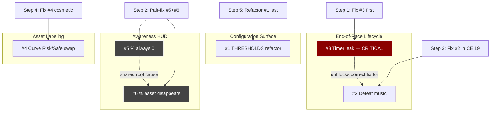
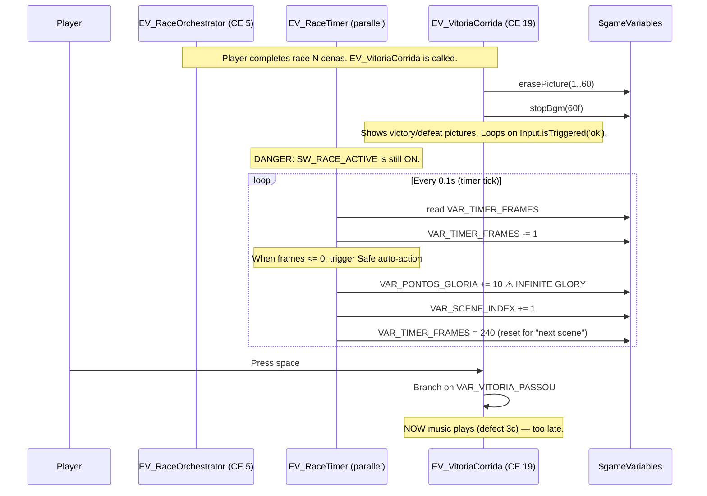

/
# Implementation Guide — Race Scene Feedback Batch

> **Reader contract.** You are an AI agent specialist in RPG Maker MZ (RMMZ) v1.x and JavaScript ES2017+, about to modify the race scene of the *Jhonny* project. This guide is your only required reading before implementation. It is **not** a tutorial; it is a dense technical brief. Every recommendation has a justification grounded in either `rmmz_*.js` engine code, the Coreto/PKD plugin patterns, or the *Corrida — Core Loop v1* spec.
>
> **Before you touch any file.** Open `Jhonny/js/plugins/Jhonny_RaceHelper.js` (193 lines) and read it in full. Use `rg -n "THRESHOLDS|threshold|isVictory|JhonnyRace|playBgm|playMe|erasePicture|showPicture|CONSCIENCIA|GLORIA|TAXA|VITORIA|DERROTA" Jhonny/js/plugins/Jhonny_RaceHelper.js` to anchor your reading. The spec doc declares the *intended* behavior; the plugin file is the *current* behavior. Drift happens. Always verify.

---

## Table of Contents

1. [Architectural Overview](#1-architectural-overview)
2. [Issue #1 — Refactor `THRESHOLDS` into `window.JhonnyRace`](#2-issue-1--refactor-thresholds-into-windowjhonnyrace)
3. [Issue #2 — Defeat Scene Music](#3-issue-2--defeat-scene-music)
4. [Issue #3 — Timer Keeps Ticking on Victory/Defeat Screen (Critical)](#4-issue-3--timer-keeps-ticking-on-victorydefeat-screen-critical)
5. [Issue #4 — Curve Scene Asset Inversion](#5-issue-4--curve-scene-asset-inversion)
6. [Issue #5 — Awareness `%` Always at 0%](#6-issue-5--awareness--always-at-0)
7. [Issue #6 — Awareness `%` Asset Disappears After First Attempt](#7-issue-6--awareness--asset-disappears-after-first-attempt)
8. [Implementation Order](#8-implementation-order)
9. [RMMZ Core References](#9-rmmz-core-references)
10. [Best Practices](#10-best-practices)
11. [Implementation Checklist](#11-implementation-checklist)

---

## 1. Architectural Overview

### 1.1 Issue Map

Six issues were raised. They cluster into three architectural concerns:

| Cluster | Issues | Shared Root Cause? | Risk Tier |
|---------|--------|--------------------|-----------|
| **Configuration surface** | #1 (THRESHOLDS refactor) | No — pure refactor | Low (cosmetic) |
| **End-of-race lifecycle** | #2 (defeat music), #3 (timer leak) | Partial — both live in `EV_VitoriaCorrida` (CE 19) per spec §8.3 | **#3 is Critical (glory exploit)** |
| **Awareness HUD rendering** | #5 (% stuck at 0), #6 (% asset disappears) | **Likely yes** — both symptoms of a single TextPicture lifecycle bug | Medium (UX-breaking) |
| **Asset labeling** | #4 (Risk/Safe swap in Curve) | No — isolated picture wiring | Low (cosmetic) |

> **Architectural insight.** Issues #5 and #6 should be debugged as a pair. A TextPicture that captures `VAR_TAXA_SUCESSO` at creation time and is never refreshed will appear stuck at 0% (issue #5). When the scene restarts and the picture is erased by `EV_Crash` (which per spec §8.3 erases pictures 1–60) but the re-show path is gated on a one-shot flag, the asset vanishes (issue #6). Fix the lifecycle first; the 0% symptom likely resolves with it.

### 1.2 Dependency Graph



### 1.3 Design Principles for This Batch

1. **Native events first.** Spec §1 explicitly mandates "Sem plugins" (no plugins) for the core loop. Where a fix can be expressed in `Show Picture` / `Move Picture` / `Control Variable` / `Control Switch` / `Play ME` commands inside an existing Common Event, prefer that over extending `Jhonny_RaceHelper.js`. The plugin exists to expose helpers that *cannot* be expressed event-side (RNG, threshold tables, complex branching).
2. **The plugin is a configuration surface, not a logic owner.** `Jhonny_RaceHelper.js` should expose pure functions on `window.JhonnyRace.*`. Game state (`$gameVariables`, `$gameSwitches`) remains authoritative; the plugin reads, never owns.
3. **Parallel Common Events must have a single kill switch.** `SW_RACE_ACTIVE` (Editor ID 100, spec §13.3) is the canonical pause signal. Every parallel CE in the race scene must early-return when this switch is OFF. Bug #3 exists because `EV_RaceTimer` violates this contract somewhere on the victory/defeat path.
4. **Pictures 1–60 are owned by the race scene.** Per spec §8.3, `EV_VitoriaCorrida` erases pictures 1–60 defensively. Any new picture for HUD must either (a) live in this range and tolerate the wipe, or (b) live outside this range (61+) and manage its own lifecycle. Mixing the two is how pictures "disappear" (issue #6).

---

## 2. Issue #1 — Refactor `THRESHOLDS` into `window.JhonnyRace`

### 2.1 Why

**Symptom (user voice):** *"Mover THRESHOLDS para Jhonny_RaceHelper.js como um objeto de config + função helper."*

Today the threshold table (60 / 100 / 150 per race — spec §8.2) is inlined wherever a victory check happens: likely inside an inline `Script` command in `EV_VitoriaCorrida` (CE 19), possibly duplicated across `EV_RaceOrchestrator` (CE 5) and `Jhonny_RaceHelper.js`. Duplicated magic numbers rot.

**Architectural justification for the move:**

1. **Single source of truth.** The spec §8.2 table is normative; the plugin becomes its executable mirror. Inline scripts in Common Events cannot be grep'd for constants; `window.JhonnyRace.THRESHOLDS` can.
2. **Playtest tunability.** The spec marks these as `[PLAYTEST]`-calibrated. Centralizing them means a designer can tune all three races by editing one object, instead of hunting through CE JSON.
3. **Tests are possible.** Pure functions on `window.JhonnyRace.isVictory(...)` can be exercised from a console during playtest (`window.JhonnyRace.isVictory(59, 1)` → `false`), which you cannot do with an inline CE script.
4. **Pattern alignment with Coreto plugins.** `Coreto_Currency.js`, `Coreto_Killin.js`, and `Coreto_StateEffects.js` all expose `window.Coreto.<Feature>` config namespaces (verify with `rg -n "window\.Coreto" projectX/frontend/js/plugins/Coreto_*.js`). `JhonnyRace` follows the same shape.

### 2.2 Pattern Reference

The Coreto family uses this idiom (paraphrased — verify exact shape by reading the files):

```javascript
// Coreto pattern (illustrative — verify before copying)
(() => {
    const Coreto = window.Coreto || {};
    Coreto.Currency = Coreto.Currency || {};
    Coreto.Currency.DEFAULTS = { startingGold: 0, cap: 99999 };
    Coreto.Currency.normalize = function (value) {
        return Math.max(0, Math.min(this.DEFAULTS.cap, value | 0));
    };
    window.Coreto = Coreto;
})();

const PluginName = "Coreto_Currency";
const params = PluginManager.parameters(PluginName);
// ... parameter binding ...
```

**Key observations:**
- **IIFE wrapper** prevents global leakage.
- **Defensive `|| {}`** lets other files extend the namespace.
- **`PluginManager.parameters`** is the canonical way to read plugin parameters declared in `pluginList`. The user-visible thresholds can be exposed as plugin params too, but that is *optional* — pure JS constants are fine for a gamejam.
- **`Math.max(0, Math.min(cap, value | 0))`** is the canonical clamp-and-coerce pattern. `| 0` is faster than `Math.floor` for positive numbers and silently drops NaN to 0.

### 2.3 Pseudo-code

```javascript
// In Jhonny/js/plugins/Jhonny_RaceHelper.js (top-level, inside the IIFE)

// 1. Namespace setup (defensive — plays nice with future Jhonny_* plugins)
const JhonnyRace = window.JhonnyRace || {};
JhonnyRace.Config = JhonnyRace.Config || {};

// 2. Threshold table — mirrors spec §8.2 verbatim
JhonnyRace.Config.THRESHOLDS = Object.freeze({
    1: 60,   // Lenda (6 cenas)  — Safe puro basta
    2: 100,  // Rachadura (8 cenas) — exige ≥2 Risk sucessos
    3: 150,  // Abismo (10 cenas) — exige múltiplos Risk altos
});

// 3. Default fallback — defensive for any future race id outside 1..3
JhonnyRace.Config.DEFAULT_THRESHOLD = 60;

// 4. Pure helpers — never read game state directly, take args
JhonnyRace.isVictory = function (pontosGloria, raceId) {
    const t = this.Config.THRESHOLDS[raceId] ?? this.Config.DEFAULT_THRESHOLD;
    return (pontosGloria | 0) >= t;
};

JhonnyRace.thresholdFor = function (raceId) {
    return this.Config.THRESHOLDS[raceId] ?? this.Config.DEFAULT_THRESHOLD;
};

// 5. Publish
window.JhonnyRace = JhonnyRace;
```

**Usage from CE inline `Script` command (replaces existing inline threshold check):**

```javascript
// Before (probable current state in CE 19, EV_VitoriaCorrida)
// const thr = $gameVariables.value(100) === 1 ? 60 : $gameVariables.value(100) === 2 ? 100 : 150;
// $gameVariables.setValue(117, $gameVariables.value(105) >= thr ? 1 : 0);

// After
const raceId  = $gameVariables.value(100);  // VAR_RACE_ID
const pontos  = $gameVariables.value(105);  // VAR_PONTOS_GLORIA
$gameVariables.setValue(117, window.JhonnyRace.isVictory(pontos, raceId) ? 1 : 0);
```

### 2.4 Migration Safety

| Step | Action | Verification |
|------|--------|--------------|
| 1 | Read `Jhonny_RaceHelper.js` and `CommonEvents.json` for every site that compares `VAR_PONTOS_GLORIA` against a literal `60`, `100`, or `150`. | `rg -n "\b(60|100|150)\b" Jhonny/data/CommonEvents.json` and `rg -n "threshold" Jhonny/js/plugins/Jhonny_RaceHelper.js` |
| 2 | Add the namespace block in §2.3 to the top of `Jhonny_RaceHelper.js`. | Open the plugin file; namespace must be defined before any IIFE body that consumes it. |
| 3 | For each site, replace literal comparison with `window.JhonnyRace.isVictory(...)` call. | Use console during playtest: `window.JhonnyRace.isVictory(60, 1)` → `true`. |
| 4 | Keep one literal reference alive as a **fallback assert** in `EV_VitoriaCorrida`: if `typeof window.JhonnyRace === 'undefined'`, fall back to the inline literal table and `console.warn` once. | Defensive against plugin-load-order regressions. Remove after F8 playtest confirms. |

> [!warning] Plugin load order matters
> `Jhonny_RaceHelper.js` must appear in `plugins.js` **before** any other plugin that consumes `window.JhonnyRace` at load time. RMMZ loads plugins in the order declared in `Jhonny/js/plugins/plugins.js`. Verify with `cat Jhonny/js/plugins/plugins.js | jq '.[] | select(.name | contains("Jhonny")) | .name'`. If `Jhonny_RaceHelper` is not first, the consumer pattern in §2.3 (IIFE-defensive `|| {}`) absorbs the ordering risk — but only at runtime, not at static-load time. For CE inline scripts this is irrelevant (CEs run after all plugins load).

---

## 3. Issue #2 — Defeat Scene Music

### 3.1 Current Behavior

**Symptom (user voice):** *"Alterar musica da cena de `DERROTA`. quando o jogador perde, toca a mesma musica de quando ganha. A musica atual é mais legal para uma vitoria."*

Per spec §8.3 step 3, the current `EV_VitoriaCorrida` (CE 19) sequence is:

1. Erase pictures 1–60.
2. Stop BGM (60-frame fadeout).
3. **`Play ME "Victory"` — unconditional.**
4. Show background picture.
5. Compute `VAR_VITORIA_PASSOU` (Editor ID 117).
6. Show one of two TextPictures: 53 (VITÓRIA) or 56 (DERROTA).
7. Wait for input.

Step 3 is the bug: it plays the victory ME *before* the win/loss branch, so defeat sounds like victory.

> [!note] Why the spec author placed Play ME before the branch
> Reading §8.3 charitably, the author intended a "cerimonial moment" — stop BGM, play a short sting, *then* reveal outcome. That design collapses when the sting is victory-themed. The fix is not to move the ME after the branch (that delays the emotional beat), but to **select the ME by branch**.

### 3.2 RMMZ Audio Stack

RMMZ exposes three audio channels in `rmmz_managers.js` / `rmmz_objects.js`:

| Channel | Manager Method | Typical Use | Persists Across Scenes? |
|---------|----------------|-------------|-------------------------|
| **BGM** (Background Music) | `AudioManager.playBgm(bgm)`, `stopBgm()`, `fadeOutBgm(duration)` | Looping background track | Yes until stopped |
| **BGS** (Background Sound) | `AudioManager.playBgs`, `stopBgs` | Ambient loops | Yes until stopped |
| **ME** (Musical Effect) | `AudioManager.playMe(me)`, `stopMe()` | Short stingers (victory, game over) | Plays once, then BGM resumes by default |
| **SE** (Sound Effect) | `AudioManager.playSe(se)`, `stopSe()` | One-shot SFX | Plays once |

**Key behavior — ME resumes BGM on completion.** From `rmmz_managers.js` (`AudioManager.playMe` → on `WebAudio._onEnd`): when an ME finishes, RMMZ re-plays the currently-scheduled BGM if `AudioManager._currentBgm` is non-null. **This is why the spec calls for `Stop BGM` *before* `Play ME`** — otherwise after the victory stinger the race BGM would restart over the defeat screen.

**Recommended channel for the defeat sting:** ME (consistent with victory ME). Keep SE for crash impacts (spec §9 already uses `Shock1` ME for crash).

### 3.3 Recommended Approach

**Option A — Branch on outcome, play distinct ME per branch (Preferred).**

```
# Inside EV_VitoriaCorrida (CE 19), replacing step 3 of spec §8.3:

# After step 2 (Stop BGM) and BEFORE step 5 (compute VITORIA_PASSOU),
# actually compute VITORIA_PASSOU first so we can branch on music:
# (Reorder: compute first, then branch on music, then show pictures.)

If VAR_VITORIA_PASSOU == 1:
    Play ME "Victory"   # existing asset
Else:
    Play ME "Defeat"    # new asset — see §3.4

# Then continue with step 6 (show pictures).
```

**Why compute `VAR_VITORIA_PASSOU` earlier than spec §8.3:**
The spec's ordering (Show background → Compute → Show pictures) was a presentation choice. The branch point for music must happen *before* the stinger plays, so the value must be computed *before* the stinger. This is a safe reorder: computing `VAR_VITORIA_PASSOU` is a pure `$gameVariables` mutation with no visible side-effect.

**Option B — Two distinct BGMs instead of MEs.**

If the designer wants longer musical sequences for victory vs defeat, swap the BGM channel:

```
Stop BGM (60-frame fade)
If VAR_VITORIA_PASSOU == 1:
    Play BGM "Victory_Long"   # looping, ~15s+
Else:
    Play BGM "Defeat_Long"
# ... (no ME) ...
# On space-press: Stop BGM, transition
```

**Trade-off:** Option A is closer to spec intent (cerimonial stinger) and requires only one new ME asset. Option B is heavier (two new BGM assets) and forces an explicit `Stop BGM` on every exit path. **Prefer Option A** unless the designer specifies longer musical beats.

### 3.4 Asset Inventory

Per spec §9 and the F6 decisions: `Jhonny/audio/me/` already contains `Shock1` (used for crash). The user must source or compose a defeat ME.

**Verification command (run before implementation):**

```bash
ls -la Jhonny/audio/me/
```

**Candidate MEs in the RMMZ default RTP (if the project is using them):**
- `Defeat.ogg` (or `Gameover1.ogg` depending on RMMZ version) — semantically aligned.
- `Victory.ogg`, `Victory2.ogg` — already in use or available.

If no defeat ME exists in `Jhonny/audio/me/`, the implementing agent must **block and ask the user** for the asset. Do not silently reuse the victory ME. Do not invent a file name.

> [!important] ME files must be in `Jhonny/audio/me/`
> RMMZ `Play ME` event command resolves file names relative to `audio/me/`. Placing the file in `audio/bgm/` will silently fail to play. Verify the directory before wiring the command.

---

## 4. Issue #3 — Timer Keeps Ticking on Victory/Defeat Screen (Critical)

### 4.1 Bug Anatomy

**Symptom (user voice):** *"Se o Jogador ficar parado na tela de Vitoria/Derrota o contador continua rodando e jogador ganha gloria (porque quando o timer zera ele ganha 10 de gloria.) A musica de derrota só toca depois que o jogador aperta a barra de espaço."*

This is the most severe bug in the batch. It is an **infinite-glory exploit**: a player can idle on the victory/defeat screen and accumulate `+10` Pontos de Glória every time the timer expires, because the Safe auto-resolution path (spec §4 / §5 — "Timer expira sem input → executa ação safe automática") keeps firing while the screen is showing.

**Two co-occurring defects:**

| Defect | Cause | Effect |
|--------|-------|--------|
| **3a. Timer leak** | `EV_RaceTimer` (parallel CE) does not early-return when the race has ended. | Timer continues decrementing `VAR_TIMER_FRAMES` on the victory/defeat screen. |
| **3b. Input/gloria side-effect on timeout** | When `VAR_TIMER_FRAMES <= 0`, the timeout path (spec §13.4) executes Safe auto-action: `VAR_CONSCIENCIA += 10`, `VAR_PONTOS_GLORIA += 10`, `VAR_SCENE_INDEX += 1`. The `+= 10` to glory fires unconditionally. | Each timeout cycle awards +10 glory. Player idles → infinite glory. |
| **3c. Music gating bug** | The defeat ME (issue #2) plays only after the player presses space, which means the cerimonial sting is gated on input rather than on screen entry. | Player hears nothing (or stale BGM) until pressing space. |

### 4.2 The Glory Exploit Chain



**Why `SW_RACE_ACTIVE` does not save us.** Spec §13.3 declares `SW_RACE_ACTIVE` (Editor ID 100) as "ON during race, OFF in VN/menu." The cerimonial screen is neither "race" nor "VN/menu" — it is a transitional state. The current implementation likely keeps `SW_RACE_ACTIVE = ON` during the cerimonial screen because `EV_VitoriaCorrida` was invoked *from within* the race orchestrator. **The fix is to treat the cerimonial screen as a non-race state and turn `SW_RACE_ACTIVE = OFF` at the top of `EV_VitoriaCorrida`.**

### 4.3 Fix — Three-Coordinated-Changes

The fix requires three coordinated mutations to `EV_VitoriaCorrida` (CE 19):

#### Change 1 — Kill the parallel CEs on screen entry

At the **top** of `EV_VitoriaCorrida` (before step 1 of spec §8.3):

```
Control Switches: #001 SW_RACE_ACTIVE = OFF
Control Switches: #002 SW_INPUT_LOCKED = ON     # defensive — no input during cerimonial
Control Switches: #004 SW_PAUSED = ON           # canonical pause signal (spec §13.3)
```

This causes `EV_RaceTimer` (and any other parallel CE gating on these switches) to early-return on its next 0.1s tick, halting defect 3a and 3b.

> [!warning] The controlSwitch code 121 inversion
> Per spec §13.3 callout: `params[2] === 0` → switch **ON**; `params[2] === 1` → switch **OFF**. **Always audit raw JSON** after editing the CE in the editor. The bug history (F5) shows this inversion has bitten the project once already.

#### Change 2 — Defensive abort in `EV_RaceTimer`

Even with `SW_RACE_ACTIVE = OFF`, add a defensive abort at the top of `EV_RaceTimer`'s loop body:

```
# EV_RaceTimer (parallel CE), at top of Label TICK loop:
If SW_RACE_ACTIVE == OFF:
    Exit Event Processing   # stop ticking immediately

# Existing tick logic below:
VAR_TIMER_FRAMES -= 1
If VAR_TIMER_FRAMES <= 0:
    Call EV_TimeoutPath
    Exit Event Processing
Jump to Label: TICK
```

This is belt-and-suspenders: if any future code path turns the switch back on without restarting the timer cleanly, the timer self-disables.

#### Change 3 — Defensive abort in the timeout path

In whichever CE handles the timeout (likely `EV_RaceTimer` itself calls inline logic, or it calls `EV_ResolucaoSafe`), add:

```
# At the very top of EV_ResolucaoSafe (or equivalent):
If VAR_SCENE_INDEX >= VAR_RACE_N_CENAS:
    Exit Event Processing   # we're past the end; do NOT award +10 glory

# Existing logic:
VAR_CONSCIENCIA = min(100, VAR_CONSCIENCIA + 10)
VAR_PONTOS_GLORIA += 10        # ⚠️ this is the exploit line — only safe if we're still mid-race
VAR_SCENE_INDEX += 1
```

**Why this matters:** Even if 3a and 3b are fixed at the timer level, any other CE that calls `EV_ResolucaoSafe` while past the end of the race would re-introduce the bug. The check `VAR_SCENE_INDEX >= VAR_RACE_N_CENAS` is the invariant that defines "race is over."

### 4.4 Pseudo-code — Final `EV_VitoriaCorrida` shape

```
# EV_VitoriaCorrida (CE 19) — revised top-to-bottom

# === NEW: freeze the race ===
Set Switch SW_RACE_ACTIVE = OFF
Set Switch SW_INPUT_LOCKED = ON
Set Switch SW_PAUSED = ON

# === Existing step 1: cleanup ===
Erase pictures 1..60

# === Existing step 2: BGM out ===
Stop BGM (60-frame fade)

# === Reordered: compute VITORIA_PASSOU BEFORE Play ME (issue #2) ===
Script: $gameVariables.setValue(117,
          window.JhonnyRace.isVictory(
            $gameVariables.value(105),    # VAR_PONTOS_GLORIA
            $gameVariables.value(100)     # VAR_RACE_ID
          ) ? 1 : 0);

# === NEW (issue #2): branch music on outcome ===
If VAR_VITORIA_PASSOU == 1:
    Play ME "Victory"
Else:
    Play ME "Defeat"   # asset must exist (see §3.4)

# === Existing step 4: background picture ===
Show Picture 5: bg_vitoria (or bg_derrota — branch again if assets differ)

# === Existing step 6: outcome text ===
If VAR_VITORIA_PASSOU == 1:
    Show Picture 53: "VITÓRIA!"  (color 6, gold)
Else:
    Show Picture 56: "DERROTA!"  (color 18, red)
Show Picture 54: "Pontos de Glória: \V[105]"  (white)
Show Picture 55: "Pressione [Espaço] para continuar"  (gray)

# === Existing step 7: input wait loop ===
Label WAIT_INPUT
Wait 1 frame
If Not Input.isTriggered('ok'):
    Jump to Label: WAIT_INPUT

# === Existing step 8: cleanup + branch ===
Script: for (let i of [5,53,54,55,56]) $gameScreen.erasePicture(i);
Set Switch SW_PAUSED = OFF
Set Switch SW_INPUT_LOCKED = OFF
# (SW_RACE_ACTIVE stays OFF — next race will turn it ON via EV_RaceOrchestrator INIT)

If VAR_VITORIA_PASSOU == 1:
    If VAR_RACE_ID < 3:
        Control Variables: VAR_RACE_ID += 1
        Call EV_RaceOrchestrator
    Else:
        # End-game screen
        ...
Else:
    Call EV_Crash    # restart same race
```

### 4.5 Verification Plan (Manual Playtest)

1. Complete race 1 legitimately. On victory screen, **do not press space.**
2. Open F9 dialog (or watch the HUD if `VAR_PONTOS_GLORIA` is exposed). The value must **not increase** while idling.
3. Wait 30 seconds (well past 10 timer cycles = potential +100 glory).
4. Press space. Confirm glory value is unchanged from end-of-race value.
5. Repeat for defeat screen (intentionally fail a Risk action to crash → defeatscreen path; or complete race with score below threshold).

> [!important] F12 console focus pauses the game loop
> Per the project memory `mz-playtest-pauses.md`: pressing F12 to open DevTools pauses the RMMZ game loop. Tests that rely on `setTimeout` callbacks or parallel CE ticks will return 0 invocations while the console is focused. **To verify issue #3, do NOT use F12.** Watch `$gameVariables.value(105)` via F9 (the in-game variable viewer) or by displaying it on a debug picture.

---

## 5. Issue #4 — Curve Scene Asset Inversion

### 5.1 Symptom Analysis

**Symptom (user voice):** *"Os assets na cena de Curva está invertido. na tela está certo, as setas, mas o da esquerda está com Risk e o da direita está com safe."*

Reading the symptom carefully: the **arrows** (setas) are correct, but the **labels** (Risk / Safe text) are swapped. By spec §5, Direita = Safe, Esquerda = Risk. The user is saying:
- **Left arrow** (correct: points left = Esquerda) → currently labeled "Risk" ✓ *Wait, that's correct semantically.*
- **Right arrow** (correct: points right = Direita) → currently labeled "Safe" ✓ *Also correct semantically.*

So either the user is reading the labels backwards, or — more likely — **the labels are spatially misplaced**: the "Risk" label appears over the **right** button (Direita/Safe) and the "Safe" label appears over the **left** button (Esquerda/Risk). That is the inversion.

Two candidate root causes:

| Hypothesis | Mechanism | Likelihood |
|------------|-----------|------------|
| **H1: Picture position swap** | The `Show Picture` commands for the Risk label and Safe label use swapped `(x, y)` coordinates. | **High** — pure JSON typo. |
| **H2: Asset file name swap** | The picture file `label_safe.png` actually renders the "Risk" graphic (or vice versa). | Low — usually catches in playtest immediately. |
| **H3: Conditional Show logic inverted** | The CE checks `If VAR_SCENE_TYPE == CURVA` and shows Risk-on-left + Safe-on-right, but the condition is inverted (`!=` instead of `==`) and labels render for the wrong scene type. | Medium — possible if the Sinal scene also has labels and the wiring crossed. |

### 5.2 Verification Procedure

Run these commands before changing anything:

```bash
# 1. Find the Show Picture commands in the renderer CE
rg -n "showPicture|Show Picture" Jhonny/data/CommonEvents.json | head -40

# 2. Find picture files matching label / risk / safe in the project
find Jhonny/img/pictures -name "*label*" -o -name "*risk*" -o -name "*safe*" 2>/dev/null

# 3. Grep for the specific Risk/Safe label pictures in the renderer
rg -n "Risk|Safe|risk|safe" Jhonny/data/CommonEvents.json | head -20

# 4. Open the relevant CE in the MZ editor (manual) and inspect the Show Picture
#    commands' (x, y) coordinates for the Risk vs Safe labels.
```

The implementing agent must identify:
- Which CE shows the labels (likely `EV_RaceRenderer` per spec §13.1, or a sub-CE named `EV_ShowCurveLabels`).
- The exact picture IDs (per spec §13.2, pictures 1–60 are owned by the race scene).
- The `(x, y)` positions for the Risk label picture and the Safe label picture.

### 5.3 Fix

**If H1 (coordinate swap):** Exchange the `(x, y)` values in the two `Show Picture` commands. Single-line JSON edit per command.

**If H2 (asset file swap):** Rename the asset files so they match their semantic meaning, OR change the `Show Picture` `name` parameter to point to the correct file. Prefer renaming the file (cleaner) over editing the CE (one change vs many).

**If H3 (condition inversion):** Audit the conditional in the renderer CE. Per spec §13.3 callout, `ControlSwitch` `params[2]` semantics are inverted from intuition; check whether the same gotcha applies to conditional branches on `VAR_SCENE_TYPE`. (It does not — conditional branches on variables use the literal comparison — but verify anyway.)

### 5.4 Defense-in-depth — Add an Assert

Once fixed, add a one-time console assert in the renderer to catch regressions:

```javascript
// In EV_RaceRenderer (or equivalent), right after showing the Curve labels:
if (typeof window.JhonnyRace !== 'undefined' && window.JhonnyRace.DEBUG) {
    const sceneType = $gameVariables.value(102);  // VAR_SCENE_TYPE
    const leftLabel  = /* expected left label semantic */;
    const rightLabel = /* expected right label semantic */;
    console.assert(leftLabel === 'RISK' && rightLabel === 'SAFE',
      '[Curve] label position invariant violated');
}
```

Set `window.JhonnyRace.DEBUG = true` during playtest; remove before ship.

---

## 6. Issue #5 — Awareness `%` Always at 0%

### 6.1 Likely Root Causes

**Symptom (user voice):** *"Valor da % de consiencia está sempre em 0% zerado"*

The "% de Consciência" is the HUD element showing the player's current success odds (`VAR_TAXA_SUCESSO`, Editor ID 106) or current awareness (`VAR_CONSCIENCIA`, Editor ID 104). Per spec §4/§5 it should be `clamp(Consciência + P_cena, 0, 100)`.

Candidate root causes, ranked by likelihood:

| Hypothesis | Mechanism | Diagnostic |
|------------|-----------|------------|
| **H1 (most likely): TextPicture snapshot** | The HUD uses `TextPicture.js` (visible in the project's plugin list). TextPicture captures the variable's value **at picture creation time** and bakes it into a bitmap. It does not re-render on variable change. The picture is created when `VAR_CONSCIENCIA = 0` (race start) and never refreshed. | Open `Jhonny_RaceHelper.js` or the renderer CE; look for `showPicture` calls with text containing `\V[104]` or `Consciência:`. These are TextPicture-rendered. |
| **H2: Wrong variable ID** | The HUD reads `\V[114]` (free/reserved) instead of `\V[104]` (CONSCIENCIA). Spec §13.2 marks 114 as "reservado para uso futuro." | Grep for the picture text in `CommonEvents.json`. |
| **H3: Variable never updated** | The CE that computes `VAR_TAXA_SUCESSO = clamp(VAR_CONSCIENCIA + VAR_P_CENA, 0, 100)` runs *after* the HUD is rendered, or doesn't run at all on the HUD update path. | Search for `setValue(106, ...)` or `setValue(104, ...)` and trace trigger conditions. |
| **H4: Race-active gate** | The HUD update CE has `If SW_RACE_ACTIVE == ON` as a guard, but the HUD render happens before the switch is turned on, so the value at switch-on time is 0. | Read the renderer CE's switch checks. |

### 6.2 The TextPicture Trap (H1 deep-dive)

RMMZ's vanilla `Show Picture` command takes a picture **file name** — it cannot render dynamic text. The project ships `TextPicture.js` (visible in `Jhonny/js/plugins/`) precisely to bridge this gap. TextPicture exposes a plugin command (or script call) that renders a string into a bitmap at runtime, then displays it as a picture.

**Critical limitation:** TextPicture generates the bitmap **once** when the picture is shown. To update the displayed value, you must:
1. Erase the picture (`Erase Picture N`).
2. Re-`Show Picture N` with the new text (which TextPicture re-renders).

This is exactly the kind of bug that produces "always 0%": the picture is created once at race start, the value is 0 at that moment, and no code path re-renders it.

**Verification:**

```bash
rg -n "TextPicture|textPicture|text_picture" Jhonny/data/CommonEvents.json Jhonny/js/plugins/Jhonny_RaceHelper.js | head -20
```

### 6.3 Fix — Two Options

**Option A — Refresh the TextPicture every frame (or every N frames).**

Create a new parallel CE `EV_UpdateHud` that runs only during the race:

```
# EV_UpdateHud (parallel CE, switch: SW_RACE_ACTIVE)

Label HUD_TICK
If SW_RACE_ACTIVE == OFF:
    Exit Event Processing

# Read current values
Script:
  const c = $gameVariables.value(104);  // CONSCIENCIA
  const p = $gameVariables.value(103);  // P_CENA
  const taxa = Math.max(0, Math.min(100, c + p));
  $gameVariables.setValue(106, taxa);   // TAXA_SUCESSO

# Re-render the HUD picture (erase + show)
Erase Picture 50  # or whatever ID the awareness HUD uses
Show Picture 50: TextPicture("Consciência: " + c + "%  (Taxa: " + taxa + "%)")

Wait 6 frames  # ~10 Hz refresh — smooth enough, cheap
Jump to Label: HUD_TICK
```

**Why 6 frames (10 Hz):** RMMZ runs at 60 FPS. Refreshing the HUD every frame is wasteful — the value only changes on Safe/Risk resolution, which happens at most once per ~4 seconds. 10 Hz is a defensive middle ground that catches rapid updates without burning CPU on a re-render every frame.

**Option B — Use a dedicated sprite instead of TextPicture (more invasive).**

For a gamejam MVP, **prefer Option A.** A dedicated `Sprite_Text` extension (subclassed from `PIXI.Text` or `Bitmap`-backed) would be more efficient but requires a new plugin file and integration with the scene. Not worth the cost for one HUD element.

### 6.4 Connection to Issue #6

If the HUD TextPicture is erased by `EV_Crash` (which erases pictures 1–60 per spec §8.3) on the way to restart, and `EV_UpdateHud` is structured to **only re-show the picture if it doesn't already exist**, then on restart the picture stays erased — the symptom of issue #6. The fix in §7 addresses this directly.

---

## 7. Issue #6 — Awareness `%` Asset Disappears After First Attempt

### 7.1 Lifecycle Analysis

**Symptom (user voice):** *"Depois da primeira tentativa, o asset que mostra a % da consiencia desaparece."*

"First attempt" = first crash + restart cycle. Per spec §7, restart invokes `EV_Crash` which per spec §8.3 erases pictures 1–60. If the awareness HUD is one of those pictures, it disappears on restart.

**The lifecycle mismatch:**

| Phase | What Happens to the HUD Picture |
|-------|----------------------------------|
| Race 1, attempt 1, start | `EV_RaceRenderer` does `Show Picture 50` (HUD). Visible. ✓ |
| Race 1, attempt 1, crash | `EV_Crash` does `Erase Picture 1..60`. HUD gone. |
| Race 1, attempt 2, restart | `EV_RaceOrchestrator` INIT runs. Does it re-show picture 50? **This is the bug — likely no.** |
| Race 1, attempt 2, play | HUD invisible. ✗ |

### 7.2 Common Pitfalls

1. **Re-show gated on a one-shot flag.** If the renderer tracks `VAR_LAST_RENDERED_INDEX` (spec §13.2, Editor ID 113) and only shows the HUD when this value changes from "uninitialized" to "0," the second attempt (which also starts at index 0) does not re-trigger the show.
2. **Re-show lives in the wrong CE.** The HUD show command is in `EV_RaceRenderer` (which observes `VAR_SCENE_INDEX` changes), but on restart the orchestrator resets `VAR_SCENE_INDEX` to 0 *and* `VAR_LAST_RENDERED_INDEX` to 0 — the renderer sees no change and does not re-render.
3. **Erase granularity.** `EV_Crash` uses `for (let i = 1; i <= 60; i++) $gameScreen.erasePicture(i);` (or equivalent). If the HUD picture is in this range, it dies on every crash. If it lives outside (61+), it survives but needs separate lifecycle management.

### 7.3 Fix

**Preferred approach — Re-show the HUD explicitly in `EV_RaceOrchestrator` INIT.**

```
# EV_RaceOrchestrator (CE 5), INIT block (per spec §13.4):

# Existing reset logic:
Control Variables: VAR_CONSCIENCIA = 0
Control Variables: VAR_PONTOS_GLORIA = 0
Control Variables: VAR_SCENE_INDEX = 0
Control Variables: VAR_VITORIA_PASSOU = 0
Control Variables: VAR_ATTEMPT_N += 1
Script: $gameVariables.setValue(110, Math.floor(Math.random() * 1e9));  // VAR_SEED
Control Variables: VAR_RACE_N_CENAS = (race 1) ? 6 : (race 2) ? 8 : 10

# === NEW: force HUD visible on every race start ===
Set Switch SW_RACE_ACTIVE = ON   # before HUD show so EV_UpdateHud starts ticking
Show Picture 50: TextPicture("Consciência: 0%  (Taxa: 0%)")  # initial frame
```

This makes the HUD show **unconditional** at race start, regardless of whether it was previously erased.

**Alternative — Move the HUD outside the erase range.**

Move the HUD picture ID from 50 (inside the crash-erase range) to 70 (outside). Then `EV_Crash` does not erase it, and the HUD persists across restarts. The trade-off: the HUD is now visible during the crash flash and the cerimonial screen unless separately managed.

**Recommendation:** Use the **Preferred approach**. Keep the HUD in the 1–60 range so it dies cleanly on crash (avoiding visual artifacts during the crash flash), and explicitly re-show it in `EV_RaceOrchestrator` INIT.

### 7.4 Link to Issue #5

With both fixes applied:

1. `EV_RaceOrchestrator` INIT shows picture 50 with the initial 0% text.
2. `EV_UpdateHud` (parallel CE) ticks every 6 frames, erases picture 50, re-shows it with the current value.
3. `EV_Crash` erases picture 50 (along with 1–60).
4. Next iteration of `EV_RaceOrchestrator` INIT re-shows picture 50.

Both `% always 0%` (#5) and `% disappears` (#6) resolve together.

---

## 8. Implementation Order

### 8.1 Priority Matrix

| Issue | Severity | Complexity | Risk | Recommended Order |
|-------|----------|------------|------|-------------------|
| **#3** Timer leak + glory exploit | **Critical** (game-breaking) | Medium (3 coordinated changes) | Medium (touches `EV_RaceTimer`, `EV_VitoriaCorrida`, `EV_ResolucaoSafe`) | **1st** |
| **#2** Defeat music | High (UX, blocks #3 fix completeness) | Low (one branch) | Low | **2nd** — bundled with #3 since both edit CE 19 |
| **#5** Awareness % at 0% | Medium (UX-breaking) | Low (CE wiring) | Low | **3rd** — pair with #6 |
| **#6** Awareness % disappears | Medium (UX-breaking) | Low (CE wiring) | Low | **3rd** — pair with #5 |
| **#4** Curve asset inversion | Low (cosmetic) | Low (one Show Picture edit) | Low | **4th** |
| **#1** THRESHOLDS refactor | Low (no user-visible behavior change) | Low-Medium (refactor across multiple sites) | Low (defensive fallback keeps it safe) | **5th** — last, since it touches many sites |

### 8.2 Recommended Sequence

1. **Issue #3 first.** It is the only Critical bug. Fix the glory exploit before any other work — a playtester finding infinite glory will lose trust in the build.
2. **Issue #2 in the same CE-edit pass as #3.** Both touch `EV_VitoriaCorrida` (CE 19). Doing them together avoids re-reading the same CE JSON twice.
3. **Issues #5 and #6 as one fix.** They share root cause and the fix (the `EV_UpdateHud` CE + INIT re-show) resolves both.
4. **Issue #4 standalone.** Quick cosmetic.
5. **Issue #1 last.** Pure refactor with no user-visible behavior. Doing it last means the playtester validates the bug fixes against the *current* (un-refactored) code shape, isolating variables.

### 8.3 Testing Strategy

| Test | How | Expected Result |
|------|-----|-----------------|
| **#3 glory exploit** | Win race 1, idle on victory screen 30s, check `VAR_PONTOS_GLORIA` via F9. | Value unchanged. |
| **#3 input still works** | Win race 1, press space immediately. | Transitions to race 2. |
| **#3 timer frozen on cerimonial** | F9 during cerimonial screen, watch `VAR_TIMER_FRAMES`. | Value does not decrement. |
| **#2 defeat ME** | Lose race (intentionally fail Risk) → reach defeat screen. | Defeat ME plays immediately, distinct from victory ME. |
| **#2 victory ME** | Win race → reach victory screen. | Victory ME plays (unchanged from before). |
| **#5 HUD updates** | During race, perform Safe action (+10 awareness). | HUD updates from "0%" to "10%" within 6 frames (~100ms). |
| **#5 HUD updates on Risk** | Perform Risk action with `P_cena = 50`, success. | HUD updates: awareness drops by 50, taxa recomputes. |
| **#6 HUD survives restart** | Crash mid-race → restart → HUD visible from frame 1 of next attempt. | HUD visible. |
| **#4 curve labels** | Reach any Curve scene. | Left button labeled Risk, right button labeled Safe (verify against spec §5). |
| **#1 thresholds** | In console: `window.JhonnyRace.isVictory(60, 1)` → `true`. `window.JhonnyRace.isVictory(59, 1)` → `false`. | Returns correct booleans. |
| **#1 thresholds in-game** | Win race 1 with exactly 60 glory. | Victory screen. |
| **#1 thresholds in-game** | Complete race 1 with 59 glory (all Safe, last scene timed out without risk bonus... or use console to set value). | Defeat screen. |

> [!important] User-testable feedback rule
> Per project memory `user-testable-feedback.md`: every manually-tested task MUST include **visible or audible feedback** the playtester can perceive. F12/F9 are debug-only — they do not count. For each test above, identify the visible/audible signal the playtester will see/hear:
> - **#3:** glory number on victory screen stays put (visible number).
> - **#2:** distinct defeat ME (audible).
> - **#5:** HUD number changes (visible).
> - **#6:** HUD visible (visible).
> - **#4:** labels in correct positions (visible).
> - **#1:** victory vs defeat screen shows up (visible).

---

## 9. RMMZ Core References

These are the engine files and methods the implementing agent will need to navigate. All paths relative to `Jhonny/js/`.

### 9.1 Audio

| Feature | File | Method / Symbol | Notes |
|---------|------|-----------------|-------|
| Play BGM | `rmmz_managers.js` | `AudioManager.playBgm(bgm)` | `bgm = { name, volume, pitch, pan }` |
| Stop BGM | `rmmz_managers.js` | `AudioManager.stopBgm()` | Use `fadeOutBgm(duration)` for fade |
| Play ME | `rmmz_managers.js` | `AudioManager.playMe(me)` | ME resumes BGM on completion (unless `stopBgm` was called) |
| Current BGM state | `rmmz_managers.js` | `AudioManager._currentBgm` | `null` after `stopBgm`; checked by ME end handler |
| Save/Load audio | `rmmz_objects.js` | `Game_System.prototype.audioToSaveData`, `audioFromSaveData` | Persists BGM/BGS/ME across saves |

### 9.2 Pictures

| Feature | File | Method / Symbol | Notes |
|---------|------|-----------------|-------|
| Show Picture | `rmmz_objects.js` | `Game_Screen.prototype.showPicture(num, name, origin, x, y, width, height, opacity, blendMode)` | `num` is 1-indexed; same num replaces existing picture |
| Move Picture | `rmmz_objects.js` | `Game_Screen.prototype.movePicture(num, origin, x, y, width, height, opacity, blendMode, duration)` | Animates over `duration` frames |
| Erase Picture | `rmmz_objects.js` | `Game_Screen.prototype.erasePicture(num)` | Immediate removal |
| Picture data | `rmmz_objects.js` | `Game_Picture` class | Per-picture state container |
| Picture sprite | `rmmz_sprites.js` | `Sprite_Picture` class | Renders a `Game_Picture` |
| Picture update | `rmmz_sprites.js` | `Spriteset_Base.prototype.updatePictures` (or equivalent) | Called per frame |

### 9.3 Common Events

| Feature | File | Method / Symbol | Notes |
|---------|------|-----------------|-------|
| Parallel CE tick | `rmmz_objects.js` | `Game_CommonEvent.prototype.updateParallel` | Runs the CE's list when its trigger switch is ON |
| CE listing | `rmmz_objects.js` | `Game_Map.prototype.setupCommonEvents` | Sets up parallel CEs on map load |
| Switch gating | `rmmz_objects.js` | `Game_CommonEvent.prototype.isActive` | Returns true when the CE's condition switch is ON |
| Call CE from CE | (event interpreter) | `command117` (Call Common Event) | Runs synchronously, blocks the caller |
| Exit Event Processing | (event interpreter) | `command115` | Immediately halts the current CE |

### 9.4 Variables & Switches

| Feature | File | Method / Symbol | Notes |
|---------|------|-----------------|-------|
| Read variable | `rmmz_objects.js` | `$gameVariables.value(id)` | Returns 0 if unset |
| Set variable | `rmmz_objects.js` | `$gameVariables.setValue(id, value)` | Coerces to Number; persists across save |
| Read switch | `rmmz_objects.js` | `$gameSwitches.value(id)` | Returns boolean |
| Set switch | `rmmz_objects.js` | `$gameSwitches.setValue(id, value)` | Coerces to boolean |
| Editor ID mapping | `Jhonny/data/System.json` | `variables`, `switches`, `commonEvents` arrays | Per spec §13.2 callout: array index === Editor ID (no offset) |

> [!warning] Always re-read `System.json` slice before editing IDs
> Per spec §13.2: "para qualquer edição de Common Events, ==primeiro== imprimir `variables[95:117]` e `switches[95:107]` de `System.json` como fonte de verdade." The implementing agent must `jq '.variables[95:117]' Jhonny/data/System.json` before relying on any Editor ID in this guide.

---

## 10. Best Practices

### 10.1 Do's

- **Do** read `Jhonny_RaceHelper.js` end-to-end before any edit. It is 193 lines — short enough.
- **Do** cross-reference Editor IDs against `System.json` (per spec §13.2 callout) before writing CEs.
- **Do** preserve the `EV_Crash` "reset VITORIA_PASSOU defensively in two places" pattern (spec §8.5) when adding new reset logic. The pattern is: every state variable that must start clean is reset in **both** `EV_Crash` and `EV_RaceOrchestrator` INIT.
- **Do** use `Script: for (let i of [5,53,54,55,56]) $gameScreen.erasePicture(i);` for defensive multi-picture erase. Concise and grep-friendly.
- **Do** expose new helpers on `window.JhonnyRace` (matches Coreto pattern, enables console testing).
- **Do** commit each issue's fix as a separate git commit with a conventional-commits message (`fix(race): stop timer leak on cerimonial screen`, `refactor(race): extract thresholds to window.JhonnyRace`, etc.). This makes playtest regression easy to bisect.

### 10.2 Don'ts

- **Don't** use `console.log` for permanent logging — use the project's logging pattern (per global CLAUDE.md, the project bans `console.log`/`console.error` in production code; uses `winston`). For RMMZ inline scripts where winston isn't reachable, use `console.warn` for one-shot debug and remove before ship.
- **Don't** add new parallel CEs casually. Each parallel CE runs every frame (or every Wait tick). The current race scene already has `EV_RaceTimer` + `EV_RaceRenderer` + (per this guide) `EV_UpdateHud`. Three is the upper bound for a gamejam scene.
- **Don't** put the HUD picture outside the 1–60 range without coordinating with `EV_Crash`. The erase-range is a contract.
- **Don't** use `Wait` in a non-parallel CE during the race — it blocks input. All per-frame logic must be in parallel CEs.
- **Don't** introduce new plugin files. Spec §1 mandates "Sem plugins." The existing `Jhonny_RaceHelper.js` is the only JS file the race scene should need.
- **Don't** assume `window.JhonnyRace` exists in CE inline scripts without a `typeof` guard. Plugin load order or a typo could break it; a guard makes the failure mode a `console.warn` instead of a hard crash.

### 10.3 Performance Notes

| Concern | Mitigation |
|---------|------------|
| TextPicture re-render cost | Refresh HUD at 10 Hz (6 frames) not 60 Hz. Re-rendering a small bitmap is cheap but not free. |
| Parallel CE count | Cap at 3 (`EV_RaceTimer`, `EV_RaceRenderer`, `EV_UpdateHud`). Consolidate if more are needed. |
| `$gameScreen.erasePicture` in a loop | Fine for ranges ≤60. Avoid in tight per-frame loops. |
| `Math.floor(Math.random() * 1e9)` for seed | One-shot per race start — negligible. |
| F12 DevTools open during playtest | **Pauses the RMMZ game loop** (per memory `mz-playtest-pauses.md`). Do NOT test timer/glory bugs with F12 open. |

---

## 11. Implementation Checklist

Implement in this order. Tick each box only after the corresponding verification passes.

### Phase 1 — Critical Fix (Issue #3)

- [ ] Read `Jhonny_RaceHelper.js` end-to-end.
- [ ] Read `Jhonny/data/CommonEvents.json` for CEs 5, 7, 18, 19 (orchestrator, renderer, crash, vitoria).
- [ ] Read `Jhonny/data/System.json` slice: `jq '.variables[95:117], .switches[95:107]'`.
- [ ] In `EV_VitoriaCorrida` (CE 19), add the three switch-offs at the top: `SW_RACE_ACTIVE = OFF`, `SW_INPUT_LOCKED = ON`, `SW_PAUSED = ON`. (§4.4)
- [ ] Verify the JSON for those `ControlSwitch` (code 121) commands uses `params[2]` correctly (0 = ON, 1 = OFF). (§4.3 Change 1 callout)
- [ ] In `EV_RaceTimer`, add the early-return at the top of the TICK loop. (§4.3 Change 2)
- [ ] In the Safe-resolution CE (`EV_ResolucaoSafe` or inline), add the `VAR_SCENE_INDEX >= VAR_RACE_N_CENAS` early-return. (§4.3 Change 3)
- [ ] Playtest: win race 1, idle 30s on victory screen, check `VAR_PONTOS_GLORIA` via F9 → unchanged. (§4.5)
- [ ] Playtest: lose race 1 (crash), idle 30s on defeat screen, check `VAR_PONTOS_GLORIA` → unchanged.
- [ ] Commit: `fix(race): stop timer leak and glory exploit on cerimonial screen`.

### Phase 2 — Music Fix (Issue #2, bundled with Phase 1)

- [ ] Confirm defeat ME asset exists: `ls Jhonny/audio/me/`. If missing, **block and ask user**.
- [ ] Reorder `EV_VitoriaCorrida` (CE 19): compute `VAR_VITORIA_PASSOU` **before** Play ME. (§4.4)
- [ ] Branch `Play ME` on `VAR_VITORIA_PASSOU`: Victory vs Defeat. (§3.3 Option A)
- [ ] Playtest: lose race → defeat ME plays immediately, distinct from victory ME.
- [ ] Commit: `fix(race): play distinct defeat ME on loss`.

### Phase 3 — HUD Fixes (Issues #5 and #6)

- [ ] Identify the HUD picture ID (probably 50). Search renderer CE.
- [ ] Identify whether the HUD uses TextPicture (likely yes). Run `rg -n "TextPicture" Jhonny/data/CommonEvents.json`.
- [ ] Create or extend `EV_UpdateHud` parallel CE (gated on `SW_RACE_ACTIVE`). (§6.3 Option A)
- [ ] In `EV_RaceOrchestrator` INIT (CE 5), add explicit `Show Picture 50` after the variable resets. (§7.3)
- [ ] Playtest: race 1 start → HUD visible at 0%.
- [ ] Playtest: perform Safe action → HUD updates to 10% within ~100ms.
- [ ] Playtest: crash mid-race → restart → HUD visible again at 0% from frame 1 of next attempt.
- [ ] Commit: `fix(race): refresh awareness HUD on every tick and re-show on restart`.

### Phase 4 — Curve Labels (Issue #4)

- [ ] Locate the `Show Picture` commands for Risk and Safe labels in the renderer CE.
- [ ] Verify whether the bug is H1 (coord swap), H2 (file swap), or H3 (condition inversion). (§5.2)
- [ ] Apply the corresponding fix. (§5.3)
- [ ] Playtest: reach a Curve scene → left label = Risk, right label = Safe.
- [ ] Commit: `fix(race): swap inverted Risk/Safe labels in Curve scene`.

### Phase 5 — THRESHOLDS Refactor (Issue #1)

- [ ] Find all literal `60`, `100`, `150` threshold references in CEs and plugin. (§2.4 step 1)
- [ ] Add the `window.JhonnyRace` namespace block to `Jhonny_RaceHelper.js`. (§2.3)
- [ ] Replace each literal site with `window.JhonnyRace.isVictory(...)` or `window.JhonnyRace.thresholdFor(...)`.
- [ ] Add defensive fallback in `EV_VitoriaCorrida` (`typeof window.JhonnyRace === 'undefined'` → inline literals + `console.warn`). (§2.4 step 4)
- [ ] Playtest: console check `window.JhonnyRace.isVictory(60, 1) === true`, `isVictory(59, 1) === false`.
- [ ] Playtest: in-game victory at exactly 60 glory → victory screen.
- [ ] Playtest: in-game completion at 59 glory → defeat screen.
- [ ] Commit: `refactor(race): extract THRESHOLDS to window.JhonnyRace config namespace`.

### Phase 6 — Final Verification

- [ ] Full playtest: races 1 → 2 → 3, win path. No regressions.
- [ ] Full playtest: races 1 → 1 → 1, lose-restart path. HUD survives, no glory exploit, defeat ME distinct.
- [ ] Run `rg -n "TODO|FIXME|XXX" Jhonny/js/plugins/Jhonny_RaceHelper.js Jhonny/data/CommonEvents.json` — clean.
- [ ] Update `[[Corrida - Core Loop]]` spec doc with any decisions made during implementation (e.g., final HUD picture ID, defeat ME asset name) — invoke `obsidian-markdown` skill first.

---

## Appendix A — Pre-Implementation Discovery Commands

Run all of these and capture output before editing anything.

```bash
# 1. Plugin size & structure
wc -l Jhonny/js/plugins/Jhonny_RaceHelper.js
rg -n "^function|^const|^var|^class|^window\." Jhonny/js/plugins/Jhonny_RaceHelper.js

# 2. CE index
jq '.commonEvents | to_entries | map({id: .key, name: .value.name, switchId: .value.switchId, trigger: .value.trigger})' Jhonny/data/CommonEvents.json

# 3. Variable & switch names (Editor IDs 95-120 / 95-110)
jq '.variables[95:120]' Jhonny/data/System.json
jq '.switches[95:110]' Jhonny/data/System.json

# 4. All threshold literals
rg -n "\b(60|100|150)\b" Jhonny/data/CommonEvents.json Jhonny/js/plugins/Jhonny_RaceHelper.js

# 5. Picture-related commands
rg -n "showPicture|erasePicture|movePicture" Jhonny/data/CommonEvents.json | head -40

# 6. Audio commands
rg -n "playBgm|stopBgm|playMe|stopMe|fadeOutBgm" Jhonny/data/CommonEvents.json | head -20

# 7. TextPicture usage
rg -n "TextPicture|textPicture" Jhonny/data/CommonEvents.json Jhonny/js/plugins/TextPicture.js | head -20

# 8. ME asset inventory
ls -la Jhonny/audio/me/

# 9. Plugins.js load order
jq '.[] | .name' Jhonny/js/plugins/plugins.js
```

---

## Appendix B — Wikilinks

- Spec: `[[Corrida - Core Loop]]` (normative)
- Pitch: `[[Roleta Paulista]]` (context)
- Plan folder: `Jhonny/planos/001-prototipo-core-loop/fase8/` (sibling artifacts)
- Memory: `race-feedback-batch` (issue source)

---

*End of guide. The implementing agent should now have everything required to fix all six issues without re-deriving the analysis.*
