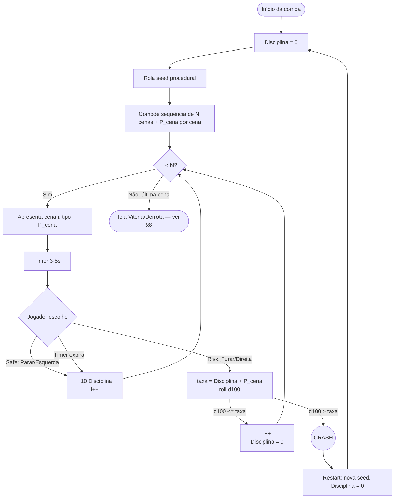

# Corrida — Core Loop v1

> **TL;DR:** cada corrida é uma corrente procedural de cenas binárias com timer (==Sinal 4,0s== / ==Curva 3,5s== fixos). Há ==2 tipos de cena==: ==Sinal== (sempre vermelho -> Parar/Furar) e ==Curva== (Direita/Esquerda). Toda cena tem uma ação ==safe== (Parar / Esquerda = +10 Disciplina, +10 Pontos de Glória, avança 1 cena) e uma ação ==risk== (Furar / Direita = roll 0-99 contra `P_cena + Disciplina`, zera Disciplina, awards `P_cena x 2` Pontos de Glória se passar). Sucesso se `roll < taxa`. Falha ou timer expira = crash ==reroll run== (nova seed + Disciplina = 0, Pontos = 0). ==Vencer = chegar em 1º lugar== (maior pontuação). São ==3 corridas fixas na narrativa== (Lenda -> Rachadura -> Abismo) escalando em comprimento (6 -> 8 -> 10 cenas). `P_cena` é sorteada por cena em `{0,10,20,...,100}`. Sem itens, sem power-ups: Disciplina (0-50, reset) + Pontos de Glória (soma cumulativa).
>
> Este doc cobre **só o core loop da corrida** (sinal + curva + Disciplina + restart procedural). Cenas VN, ConcernScore, finais e direção de arte estão especificados em [[Roleta Paulista]].
>
> [!info] Disciplina != ConcernScore
> ==Disciplina== é a barra ==visível dentro da corrida== (recurso do minigame, reset a cada corrida). ==ConcernScore== é a variável ==oculta acumulada nas cenas VN== (define qual final o jogador acessa). São ==sistemas independentes==: uma não afeta a outra diretamente.

> [!important] Estado aprovado pós-rodada 1
> `VAR_CONSCIENCIA` continua sendo o ID técnico da variável, mas a regra e a HUD atuais apresentam esse recurso como ==DISCIPLINA==. Disciplina vai de 0% a 50%, ganha +10% por ação segura, fica cheia após 5 ações seguras e zera quando o jogador escolhe uma ação arriscada. A chance real da ação arriscada é `min(100%, P_cena + Disciplina)`, exibida como `FRACASSO/SUCESSO`.

> [!warning] Escopo do MVP — Fase Especial da Curva do Diabo adiada
> Este spec descreve a ==visão completa do produto==, incluindo a ==Fase Especial da Curva do Diabo== (§6.4 — clímax fixo na última cena da Corrida 3 com `P_cena = 100`). No entanto, essa fase especial está ==fora de escopo do MVP== e será adicionada em iterações futuras do game.
>
> Para o MVP (Fase 6 do plano de implementação):
> - A **Corrida 3 (Abismo)** tem ==10 cenas normais== — sorteio 60/40 Sinal/Curva, igual às corridas 1 e 2.
> - Nenhuma cena recebe tratamento especial de clímax.
> - `SW_IS_CURVA_DIABO` (Switch Editor ID 105) está ==reservada e intocada== para uso futuro.
> - `placa_curva_dir.png` (criado em F2) fica no disco sem ser referenciado no MVP.
>
> Menções à Curva do Diabo ao longo deste spec (§1, §2, §6.1, §6.4, §9, §10, §11, §14) descrevem a ==visão de produto completa== e devem ser lidas como especificação futura, não como implementação atual. A implementação futura depende de nova decisão/plano e não é referenciada por path transiente neste documento.

---

## Índice

- [1. Visão Geral](#1-visão-geral)
- [2. Diagrama do Loop](#2-diagrama-do-loop)
- [3. Anatomia de uma Cena](#3-anatomia-de-uma-cena)
- [4. Mecânica — Cena de Sinal](#4-mecânica-cena-de-sinal)
- [5. Mecânica — Cena de Curva](#5-mecânica-cena-de-curva)
- [6. Geração Procedural](#6-geração-procedural)
- [7. Restart / Roguelite Loop](#7-restart-roguelite-loop)
- [8. Vitória e Derrota da Corrida](#8-vitória-e-derrota-da-corrida)
- [9. Feedback Multimodal](#9-feedback-multimodal)
- [10. Parâmetros Globais](#10-parâmetros-globais)
- [11. Riscos de Balanceamento](#11-riscos-de-balanceamento)
- [12. Dependências](#12-dependências)
- [13. Implementação em RPG Maker MZ](#13-implementação-em-rpg-maker-mz)
- [14. Decisões em aberto](#14-decisões-em-aberto)
- [15. Referências](#15-referências)
- [16. Próximos passos](#16-próximos-passos)

---

## 1. Visão Geral

| Atributo              | Valor                                                                                          |
| --------------------- | ---------------------------------------------------------------------------------------------- |
| **Formato**           | ==Roguelite timer-based== de decisão binária com recurso. Não é racing steering — é QTE enfileirado. |
| **Cena (unidade)**    | Decisão binária com timer fixo (==Sinal 4,0s== / ==Curva 3,5s==). Toda cena tem 1 ação ==safe== e 1 ação ==risk==. Safe avança e dá +10 Disciplina. Risk rola 0-99 contra `Disciplina + P_cena`; sucesso se `roll < taxa`. |
| **Tipos de cena**     | ==Sinal== (sempre vermelho → Parar safe / Furar risk) e ==Curva== (Direita risk / Esquerda safe). |
| **Recurso central**   | ==Disciplina== — barra visível 0-50. Reset a 0 no início de cada corrida, a cada restart e ao escolher risk. |
| **RNG**               | ==Por cena==. A cada cena sorteia-se `P_cena ∈ {0,10,20,...,100}` (uniforme). Fixo para aquela cena só. |
| **Geração**           | Procedural por corrida. Nova seed a cada início de corrida (incluindo restarts). Cada cena recebe tipo + `P_cena` via seed. |
| **Comprimento**       | Escalona: ==Corrida 1 = 6 cenas== · ==Corrida 2 = 8 cenas== · ==Corrida 3 = 10 cenas==.                    |
| **Final fixo**        | Última cena da Corrida 3 é sempre ==Curva do Diabo== (`P_cena = 100`, não-reseteável).        |
| **POV**               | Dissociativo — entre corridas você é o amigo; nas corridas você "vira" o Jhonny (ver [[Roleta Paulista]] §3 e §6). |
| **Condição de vitória**| Completar todas as `N_cenas` cenas sem crashar ==E== atingir ==threshold mínimo de Pontos de Glória==. Runtime atual validado: 200/400/600 por corrida; spec histórica anterior: 60/100/150. Ver §8 para detalhes da tela cerimonial e progressão. |
| **Condição de derrota**| Risk action com roll falho = ==crash== e tela de derrota por risk (`Map019`). Timer expira = jogada safe automática (Parar/Esquerda). ==Não atingir threshold ao final = derrota== por pontuação/posição (`Map020`). As derrotas confirmadas armam retry da mesma corrida via `SW_RACE_RETRY_PENDING`. |
| **Input**             | Mouse (clique) + teclado (setas). RPG Maker MZ expõe ambos nativamente em HTML5.               |
| **Implementação MZ**  | Common Events para regra/estado + helper ativo `Jhonny_RaceHelper.js` para HUD, microfeedback e helpers sem mover a fonte de verdade para o plugin. |

> [!important] Princípio de design
> A mecânica é **deliberadamente rasa**. Toda a profundidade vem da **leitura contextual** (saber quando arriscar) e do **arco emocional** (cada corrida carrega um tema narrativo). Em gamejam de 1 semana, "simples de implementar, profundo de sentir" vence "complexo de implementar, raso de sentir".

> [!note] Taxa de sucesso da ação risk
> `taxa_sucesso = clamp(Disciplina + P_cena, 0, 100)` · roll `0-99` · sucesso se `roll < taxa_sucesso`. Após escolher a ação arriscada, independente de sucesso ou falha, `Disciplina = 0`.

---

## 2. Diagrama do Loop


```mermaid
flowchart TD
    Start([Início da corrida]) --> InitD[Disciplina = 0]
    InitD --> Seed[Rola seed procedural]
    Seed --> Compose[Compõe sequência de N cenas + P_cena por cena]
    Compose --> Next{i < N?}
    Next -->|Sim| Scene[Apresenta cena i: tipo + P_cena]
    Scene --> Timer[Timer 3-5s]
    Timer --> Input{Jogador escolhe}
    Input -->|Safe: Parar/Esquerda| SafePlus["+10 Disciplina<br/>i++"]
    SafePlus --> Next
    Input -->|Risk: Furar/Direita| Roll["taxa = Disciplina + P_cena<br/>roll d100"]
    Roll -->|d100 <= taxa| RiskOk["i++<br/>Disciplina = 0"]
    RiskOk --> Next
    Roll -->|d100 > taxa| Crash((CRASH))
    Input -->|Timer expira| SafePlus["+10 Disciplina<br/>i++"]
    Next -->|Não, última cena| End([Tela Vitória/Derrota — ver §8])
    Crash --> Restart[Restart: nova seed, Disciplina = 0]
    Restart --> InitD
```

> [!note] Curva do Diabo
> Na visão pós-MVP, a cena final da Corrida 3 (`i = N-1 = 9`) é a **Curva do Diabo** com `P_cena = 100` (não sorteadável, não-resetável). `taxa = clamp(Disciplina + 100, 0, 100) = 100%` -> Direita sempre passa no roll, mas a ação arriscada zera Disciplina. Tensão é de consequência, não de chance. Ver §6.4.

---

## 3. Anatomia de uma Cena

Toda cena — sinal ou curva — compartilha o mesmo esqueleto. Timer é **fixo por tipo**: Sinal = 4,0s, Curva = 3,5s. Não há variação aleatória de timer.

| Fase                 | Duração        | O que acontece                                                                                       |
| -------------------- | -------------- | ---------------------------------------------------------------------------------------------------- |
| **1. Setup + botões**| 0,3s           | Fundo aparece (asfalto, sinal/placa, Opala em POV). **Botões Safe e Risk surgem imediatamente** (não há fase posterior de apresentação). Texto de contextualização sutil (1 linha). Barra de Disciplina já visível. |
| **2. Janela input**  | 4,0s (Sinal) / 3,5s (Curva) | Timer corre. Jogador clica/seta. Se não escolher → executa **ação safe automática** (Parar/Esquerda, ver §4 e §5). |
| **3. Resolução**     | 0,4s           | Animação (safe: avança / risk-sucesso: avança + efeito / risk-falha: crash). Som de motor, pneu ou batida. Em caso de risk, **Disciplina zera visualmente antes do fade** para o jogador perceber o custo. |
| **4. Atualização D** | instantâneo    | Disciplina atualizada: +10 (safe, clamp 50) ou `0` (risk). Barra reflete com flash discreto. |
| **5. Transição**     | 0,2s           | Fade para próxima cena. Atualiza `current_scene_index`.                                              |

**Duração total por cena:** ~4,9s (Sinal) / ~4,4s (Curva). Uma corrida de 6 cenas dura ~28s; uma de 10 cenas dura ~47s. Após a confirmação da tela de derrota, o handoff de retry é barato (< 1s).

---

## 4. Mecânica — Cena de Sinal

> [!summary]- Clique para expandiroverview
> Toda cena de sinal é ==vermelha== — é um sinal de parada obrigatória. O jogador escolhe entre ==Parar== (ação safe) ou ==Furar== (ação risk). Esta é a unidade de decisão moral do jogo: obedeça a lei (acumule Disciplina e +10 Pontos de Glória) ou aposte a Disciplina acumulada por `P_cena x 2` Pontos de Glória. O `P_cena` é sorteado por cena e é o que varia a tentação.

### Overview
Toda cena de sinal é **vermelha** — é um sinal de parada obrigatória. O jogador escolhe entre **Parar** (ação safe) ou **Furar** (ação risk). Esta é a unidade de decisão moral do jogo: obedeça a lei (acumule Disciplina e +10 Pontos de Glória) ou aposte a Disciplina acumulada por `P_cena x 2` Pontos de Glória. O `P_cena` é sorteado por cena e é o que varia a tentação.

### Input
- **Mouse:** clique no botão "Parar" ou "Furar".
- **Teclado:** `↓` Parar, `↑` Furar (também `S`/`W`).
- **Mobile (HTML5):** tap nos botões grandes na metade inferior da tela.
- **Context requirements:** cena ativa, timer não expirou, jogador não está em animação de resolução.
- **Input window:** 3–5s (ver §4.5).

### System

**Regras:**

| Ação  | Tipo | Efeito                                                                                       |
| ----- | ---- | -------------------------------------------------------------------------------------------- |
| Parar | Safe | Avança 1 cena. `Disciplina += 10` (clamp 50). Sempre funciona. |
| Furar | Risk | `taxa = clamp(Disciplina + P_cena, 0, 100)`. Roll `0-99`. Sucesso se `roll < taxa` -> avança 1 cena e ganha `P_cena x 2` Pontos de Glória. Senão -> crash. Após a escolha risk, qualquer que seja o resultado, `Disciplina = 0`. |

> [!important] P_cena é a tentação
> Uma cena com `P_cena = 80` é quase um "furar grátis" para quem tem Disciplina moderada, mas ainda zera a barra. Uma cena com `P_cena = 0` é "furar pra morrer" (taxa = só a Disciplina atual). A leitura do `P_cena` é o ==coração estratégico== do minigame #economia-de-risco.

**State changes:**
- `current_scene_index += 1` se Parar OU Furar-bem-sucedido.
- `Disciplina = clamp(Disciplina + 10, 0, 50)` se Parar.
- `Disciplina = 0` se Furar, independente de sucesso ou falha.
- `crash_flag = TRUE` se Furar-falha. Timer expira = ação safe automática (Parar).

**Edge cases:**

| Situação                                | Comportamento                                                                  |
| --------------------------------------- | ------------------------------------------------------------------------------ |
| Clique antes do fim do setup (0,3s)     | Input ignorado, buffer limpo.                                                  |
| Dois cliques simultâneos (Parar + Furar)| Vence o **último** clique registrado antes do tick do timer.                   |
| Timer expira sem input                  | Executa ação safe automática (Parar): +10 Disciplina, avança 1 cena.        |
| Input durante animação de resolução     | Ignorado. Buffer de input desligado nesta janela.                              |
| Furar com `Disciplina = 0`              | Permitido. `taxa = P_cena`. Aposte tudo na sorte.                              |
| `P_cena = 0` na cena                    | Furar = roll contra só `Disciplina`. Quase sempre falha no início da corrida. |
| `P_cena = 100` na cena                  | Furar = roll contra `Disciplina + 100` clampado em 100 = sempre sucesso, mas zera a Disciplina. |

### Feedback

**Visual:**
- Sinal vermelho pulsante durante toda a cena.
- Hover no botão Furar: barra de Disciplina pisca em vermelho-sangue `#8B0000` (aviso visual de custo).
- Parar: flash âmbar suave (1 frame), Opala freia (zoom-out 5%). Barra de Disciplina sobe (+10 destacado em sépia claro).
- Furar-sucesso: flash branco rápido, Opala acelera pelo sinal (zoom-in 8%, motion blur).
- Furar-falha: flash vermelho-sangue, Opala atravessa o sinal e bate (cross-traffic). Crash visual padrão.
- Crash: shake de tela (0,3s, 8px), partículas de fumaça sépia, fade to preto (0,4s).

**Áudio:**
- Parar: freada curta (0,3s) + motor caindo RPM.
- Furar-sucesso: ronco de motor subindo RPM + pneu cantando (0,5s).
- Furar-falha: ronco + impacto metálico + silêncio abrupto (0,5s).
- Timer ticking opcional: 3 ticks finais quando restam 1,5s (pitch sobe a cada tick).

**Haptic (nice-to-have, depende de API do browser em HTML5):**
- Mobile: vibrar 50ms no crash. Sem haptic em Parar.
- Implementação: `navigator.vibrate(50)` se disponível; silenciosamente ignorado caso contrário. Sem plugins.

**UI:**
- Botões Parar/Furar com ícones de pedal (estilo carimbo sépia, conforme [[Direcão de arte]]).
- **Barra de Disciplina visível** no topo da tela durante toda a corrida (ver §9).
- Timer é uma **barra horizontal fina** acima dos botões (não número — barra = mais tenso, menos cognitivo).
- **P_cena não é mostrada numericamente** ao jogador. A tentação é visual (intensidade do vermelho do sinal poderia escalar com P_cena — [PLAYTEST]).

### Parameters

| Parâmetro                     | Default | Min  | Max   | Tuning notes                                                                                          |
| ----------------------------- | ------- | ---- | ----- | ----------------------------------------------------------------------------------------------------- |
| Timer Sinal                   | 4,0s    | 3,0s | 5,0s  | Único (não há mais variação por cor — verde/amarelo não existem).                                    |
| Duração setup visual          | 0,3s    | 0,2s | 0,5s  | Muito curto = unjust; muito longo = arrasta.                                                          |
| Duração resolução             | 0,4s    | 0,3s | 0,6s  | Inclui animação + sample de áudio antes do fade.                                                      |
| Duração transição             | 0,2s    | 0,1s | 0,3s  | Fade simples.                                                                                         |
| Ganho Disciplina (Parar)      | +10     | +10  | +10   | Estado aprovado da rodada 1: não alterar sem nova decisão.                                           |
| Cap Disciplina                | 50      | 50   | 50    | Barra cheia após 5 ações seguras.                                                                    |
| Custo Disciplina (Furar)      | zera    | zera | zera  | Toda ação risk zera Disciplina, em sucesso ou falha.                                                 |
| Distribuição `P_cena`         | U{0,10,...,100} | — | — | Uniforme nos 11 valores. [PLAYTEST: talvez triangular centrada em 50 para reduzir runs extremas.]    |

### Balance notes

> 🎮 **Designer's note:** o Sinal agora carrega **toda a tensão moral**. Cada vermelho é a pergunta: *"você obedece ou aposta?"*. A `P_cena` alta (80-100) é a tentação clássica — parece grátis mas zera a Disciplina acumulada. A `P_cena` baixa (0-20) é o jogo te testar: *"você confiaria na sorte agora?"*. Em runs em que o jogador acumula Disciplina sem nunca furar, a Curva do Diabo no final da visão pós-MVP vira o momento de ruptura: sucesso garantido, Disciplina zerada.

**Comparable implementations:**
- ***Slay the Spire* card-combo com custo:** recurso gasto pra executar ação → pegamos a economia.
- ***Inscryption* apostas sacrificiais:** risco/recompensa opaco → pegamos a opacidade do `P_cena`.
- ***Reigns* (cartão binário):** decisão simples, consequências profundas → pegamos o framing minimalista.

**Riscos conhecidos:**
- Run com muitas `P_cena = 0` pode parecer "parar obrigatório" e monótona. Mitigação: jogador ainda pode furar com Disciplina acumulada.
- Run com muitas `P_cena = 100` pode parecer "furar sempre" e sem estratégia. Mitigação: zera a Disciplina rapidamente, alimentando o arco de queda.
- **Sem verde/amarelo**, o sinal perdeu variação visual. Mitigação: usar intensidade do vermelho (escala com `P_cena`) e texto de cenário (ex.: "cruzamento movimentado" vs "rua vazia").

---

## 5. Mecânica — Cena de Curva

> [!summary]- Clique para expandir Overview
> A segunda decisão binária. Apresenta uma curva à frente. ==Direita== = risco com recompensa (roll `Disciplina + P_cena`, zera Disciplina, awards `P_cena x 2` Pontos de Glória se passar). Direita bem-sucedida awards Pontos; Direita falha = crash. ==Esquerda== = trajeto seguro (certeza, +10 Disciplina, +10 Pontos de Glória). Espelha o Sinal (§4) com framing visual diferente. #curva #risco-recompensa

### Input
- **Mouse:** clique em "Direita" ou "Esquerda".
- **Teclado:** `→` Direita, `←` Esquerda (também `D`/`A`).
- **Context requirements:** cena ativa, timer não expirou.
- **Input window:** 3,5s (fixo neste v1).

### System

**Regras:**

| Ação    | Tipo | Efeito                                                                                                                |
| ------- | ---- | --------------------------------------------------------------------------------------------------------------------- |
| Direita | Risk | `taxa = clamp(Disciplina + P_cena, 0, 100)`. Roll `0-99`. Sucesso se `roll < taxa` -> avança 1 cena e ganha `P_cena x 2` Pontos de Glória. Senão -> crash. Após a escolha risk, qualquer que seja o resultado, `Disciplina = 0`. |
| Esquerda| Safe | Avança 1 cena. `Disciplina += 10` (clamp 50). Sempre funciona.                                                     |

> [!important] Pontuação de Glória #pontuação #glória
> Recompensa proporcional ao risco: Direita-sucesso awards `P_cena × 2` ==Pontos de Glória==, enquanto Esquerda awards apenas +10 pontos fixos. Em uma corrida de 6 cenas, Direita com `P_cena = 80` awards +160 pontos — ==a diferença entre 1º e 4º lugar==.
>
> ==Pontuação = determinante da posição==. Ao final da corrida, o jogador com a MAIOR pontuação total vence. Jogador que não alcançar 1º lugar sofre derrota e restart da corrida.

**State changes:**
- `current_scene_index += 1` (tanto Esquerda quanto Direita-sucesso).
- `Disciplina = clamp(Disciplina + 10, 0, 50)` se Esquerda.
- `Disciplina = 0` se Direita, independente de sucesso ou falha.
- `pontos_gloria += 10` se Esquerda, `+= (P_cena × 2)` se Direita-sucesso.
- `crash_flag = TRUE` se Direita-falha OU timer expira sem input.

**Edge cases:**

| Situação                                              | Comportamento                                                       |
| ----------------------------------------------------- | ------------------------------------------------------------------- |
| Input duplo (Direita + Esquerda no mesmo tick)        | Vence o último input.                                               |
| Timer expira sem input                                | Executa ação safe automática (Esquerda): +10 Disciplina, avança 1 cena.                                                  |
| Direita com `Disciplina = 0`                          | Permitido. `taxa = P_cena`.                                         |
| `P_cena = 0` na cena de curva                         | Direita = roll contra só `Disciplina`. Quase sempre falha no início. |
| `P_cena = 100` na cena de curva                       | Direita = sempre sucesso (clamp), mas zera a Disciplina. Custo alto. |

### Feedback

**Visual:**
- Esquerda: Opala inclina suave para a esquerda, asfalto curva em arco largo.
- Direita-sucesso: Opala faz contra-volta rápida (motion blur + partículas de pneu). Barra de Disciplina zera visivelmente.
- Direita-falha: Opala derrapa, câmera vira 90°, fade para crash.
- Crash: igual ao §4 (visual unificado).
- O **timbre da Curva do Diabo** (corrida 3, cena final): motor engasga + baixo cai uma oitava, placa envelhecida visível. Reconhecível antes do jogador terminar de ler.

**Áudio:**
- Esquerda: pneu cantando suave (0,3s).
- Direita-sucesso: pneu gritando + motor subindo RPM (0,5s).
- Direita-falha: pneu gritando + impacto + silêncio.
- Curva do Diabo: motor engasga + baixo cai uma oitava (pista diegética de áudio).

**Haptic:** vibrar 80ms em Direita-falha (mais longo que Parar-falha no Sinal, pois a curva é mais comprometedora narrativamente).

**UI:** botões Direita/Esquerda com ícones de seta curva (estilo placa de trânsito envelhecida). Hover em Direita pisca Disciplina em vermelho-sangue.

### Parameters

| Parâmetro                          | Default | Min   | Max   | Tuning notes                                                                                  |
| ---------------------------------- | ------- | ----- | ----- | --------------------------------------------------------------------------------------------- |
| Timer de curva                     | 3,5s    | 3,0s  | 4,5s  | Único para todas as curvas. [PLAYTEST: talvez encurtar na Corrida 3.]                         |
| `P_cena` range                     | {0,10,...,100} | — | — | Sorteio uniforme nos 11 valores por cena.                                                     |
| `P_cena` — Curva do Diabo          | 100     | 100   | 100   | Fixo. Não sortea. Chance base 100%; se tentado, sucesso garantido e Disciplina zerada. |

### Balance notes

> 🎮 **Designer's note:** a Curva é onde o jogo **fala com o jogador sobre o tema da jam**. "Direita" é literalmente "let chance decide". Quando o jogador escolhe Direita na corrida 3 sob POV do Jhonny, ele está **sentindo o impulso do Jhonny**. Cada Direita awards `P_cena x 2` Pontos de Glória em caso de sucesso, mas zera Disciplina. O arco Lenda -> Rachadura -> Abismo emerge naturalmente do padrão de apostas do jogador: mais Risk = mais Pontos = maior chance de 1º lugar, com menos Disciplina disponível depois.

**Comparable implementations:**
- ***Slay the Spire* RNG de encontro:** opaco ao jogador → pegamos a opacidade do `P_cena`.
- ***Balatro* poker hands:** apostar risco por multiplicador de pontuação → pegamos a economia de "troca risco por Pontos de Glória".
- ***Hades*-room variants:** randomização dentro de constraints → pegamos a estrutura.
- **Rejeitado:** mostrar `P_cena` numericamente. Mata o drama e o tema. [Jogador sente na textura visual e na frequência de crashes.]

**Riscos conhecidos:**
- Cena com `P_cena = 0` é "Direita suicide" no início da corrida (0 pontos de glória). Mitigação: visivelmente diferente (sinal mais apagado, curva mais fechada). [PLAYTEST]
- Cena com `P_cena = 100` é "Direita grátis" em chance base. Mitigação: zera Disciplina, mas awards +200 Pontos de Glória — trade-off claro.
- Como Esquerda é sempre safe, jogador pode completar a corrida sem nunca arriscar Direita — mas **não alcançará 1º lugar** sem Pontos de Glória. Quem quer vencer precisa arriscar.

---

## 6. Geração Procedural

### 6.1 Composição da corrida

Cada corrida é uma lista indexada de `0..N-1` cenas. Para cada índice `i`, sorteam-se independentemente **tipo** e **`P_cena`**:

```
for i in 0..N-1:
    if corrida == 3 and i == N-1:
        cena[i] = { tipo: CURVA_DO_DIABO, P_cena: 100 }  # fixo, não sortea
    else:
        cena[i].tipo = sorteia(SINAL, CURVA) com pesos 60/40
        cena[i].P_cena = sorteia_uniforme({0, 10, 20, 30, 40, 50, 60, 70, 80, 90, 100})
```

**Pesos default (v1):**
- SINAL: 60%
- CURVA: 40%

> [!note] Pesos diferenciados por corrida
> Decisão de design adiada para v2: corrida 1 (Lenda) pode ter mais Sinal (70/30), corrida 3 (Abismo) mais Curva (40/60). Para v1 da gamejam, manter 60/40 fixo.

### 6.2 Sorteio de `P_cena` (por cena)

- Distribuição: **uniforme** nos 11 valores `{0, 10, 20, 30, 40, 50, 60, 70, 80, 90, 100}`.
- Sorteio **independente por cena** — não há memória entre cenas, não há "P da corrida".
- Cada cena tem seu próprio `P_cena`, válido só para aquela cena.
- [PLAYTEST: se runs extremas (todas P=0 ou todas P=100) prejudicarem experiência, trocar para distribuição triangular centrada em 50.]

### 6.3 Seed

- **Seed policy (v1):** nova seed a cada entrada de corrida. Restart = nova seed.
- A seed determina: sequência de tipos (SINAL/CURVA) + `P_cena` de cada cena.
- Implementação MZ: usar variável `VAR_SEED` inicializada com `Math.floor(Math.random() * 1e9)` no início de cada corrida.

### 6.4 Curva do Diabo (final fixo) #curva-do-diabo #clímax

> [!danger]- ⚠️ CURVA DO DIABO - O CLÍMAX FINAL
> - Apenas na **Corrida 3**
> - Sempre na ==última posição== (`i = N-1 = 9`)
> - Não é sorteadável — sobrescreve qualquer composição procedural
> - ==`P_cena = 100`== (fixo, não respeita o sorteio da §6.2)
> - **Comportamento:** `taxa_sucesso = clamp(Disciplina + 100, 0, 100)` = ==sempre 100%== (sucesso garantido). MAS a ação risk zera Disciplina.
> - Cena **sempre apresentada como Curva** (não sinal). Esquerda = safe (sobrevive à corrida). Direita = sucesso garantido mas zera Disciplina.
> - Visual diferenciado: placa envelhecida "CURVA DO DIABO", cruz à beira da estrada.
> - Áudio diferenciado: motor engasga + baixo cai uma oitava (pista diegética — jogador reconhece antes de ver).

> [!warning] Mudança v2: Curva do Diabo não é mais 95% crash
> Na v1 original, Curva do Diabo tinha `P_falha = 95%`. Na regra atual com Disciplina, ela tem `P_cena = 100` (sempre passa no roll), mas **sempre zera Disciplina**. A tensão mudou de "95% de morrer" para "100% de zerar Disciplina — e o que isso significa narrativamente?" [PLAYTEST: a releitura narrativa depende da conexão Disciplina -> estado do Jhonny.]

> [!warning] Edge: intervenção (ConcernScore Alto)
> Se o ConcernScore estiver Alto (ver [[Roleta Paulista]] §9), a cena de intervenção **substitui** a Corva do Diabo — jogador sabota o Opala antes. Esse gating **não** faz parte deste core loop; está especificado no pitch. Aqui só documentamos a "pista canônica".

---

## 7. Restart / Roguelite Loop #restart #roguelite

> [!tip] Princípio do Restart
> Qualquer derrota de corrida passa por uma tela curta de resultado e, após confirmação, volta direto para a mesma corrida. Minimiza fricção: ==sem tela de game over de engine==, ==VN não replaya== entre tentativas e o handoff pós-confirmação fica barato.

### 7.1 Trigger de restart
- Risk action com roll falho → `EV_Crash`/`EV_VitoriaCorrida` → `Map019` (`Resultado Derrota Risk`) → retry da mesma corrida após confirmação.
- Fim de corrida abaixo do threshold → `EV_VitoriaCorrida` → `Map020` (`Resultado Derrota Posicao`) → retry da mesma corrida após confirmação.
- Timer expira sem input = ação safe automática, não derrota.

### 7.2 O que é preservado entre restarts
- **ConcernScore** (acumulado nas cenas VN — não é alterado por restarts de corrida).
- **Flags narrativas** (objetos entregues, escolhas de diálogo).
- **Index da corrida atual** (1, 2 ou 3) — restart não destrava próxima corrida.

### 7.3 O que é resetado entre restarts
- **Sequência procedural de cenas** + **`P_cena` por cena** (nova seed).
- **`Disciplina`** volta a **0**.
- **`current_scene_index`** volta a 0.

### 7.4 UX do restart
- Crash → feedback curto → tela `DERROTA!` de risk em `Map019` → confirmação por espaço/clique → retry da mesma corrida.
- Derrota por pontuação/posição → tela `DERROTA!` em `Map020` → confirmação por espaço/clique → retry da mesma corrida.
- **Sem tela de game over de engine.** O retry volta para `Map001`, arma a página autorun por `SW_RACE_RETRY_PENDING` e chama `EV_RaceOrchestrator` (CE 5).
- Cenas VN **não** replayam entre restarts (só na primeira vez da corrida). Jogador entra direto no minigame.

> [!tip] Restart sem VN é crucial
> Em playtest de gamejam, repetir a cena VN a cada restart mata o pacing. A VN só toca na **primeira entrada** da corrida. Restart = direto pro minigame.

---

## 8. Vitória e Derrota da Corrida #vitória #derrota #threshold

> [!important] Critério de sucesso da corrida
> Completar todas as `N_cenas` cenas sem crashar ==não garante vitória==. O jogador precisa atingir um ==threshold mínimo de Pontos de Glória== específico por corrida. Abaixo do threshold = derrota por pontuação/posição em `Map020`, seguida de retry da mesma corrida via `SW_RACE_RETRY_PENDING`.

### 8.1 Trigger de fim de corrida

Quando `VAR_SCENE_INDEX >= VAR_RACE_N_CENAS` (todas as cenas resolvidas), o `EV_RaceRenderer` (CE 7) chama `EV_VitoriaCorrida` (CE 19). No runtime aprovado, CE19 é o dispatcher de resultado: calcula vitória/derrota, limpa estado de corrida e transfere para `Map018`, `Map019` ou `Map020`.

### 8.2 Thresholds por corrida

> [!warning] Estado runtime atual vs spec histórica
> A implementação validada usa thresholds `200/400/600` para `VAR_RACE_ID` 1/2/3. A spec histórica citava `60/100/150`; não reintroduza esses valores durante refactor sem uma decisão explícita de balanceamento. O fallback de código observado para race id inesperado continua separado do tuning principal.

| `VAR_RACE_ID` | Corrida | Threshold de `VAR_PONTOS_GLORIA` atual | Pontuação máx teórica (Safe-only) | Observação de balanceamento |
|---------------|---------|----------------------------------------|------------------------------------|-----------------------------|
| 1 | Lenda (6 cenas) | ==200== | 60 | Risk é necessário mesmo na primeira corrida. |
| 2 | Rachadura (8 cenas) | ==400== | 80 | Exige múltiplos Risk-sucessos ou valores altos de `P_cena`. |
| 3 | Abismo (10 cenas) | ==600== | 100 | Exige sequência agressiva de Risk-sucessos. |

> [!note] Tuning futuro
> Se o objetivo voltar a ser "Corrida 1 passa com Safe puro" ou reduzir a exigência de Risk, trate como mudança de balanceamento com Playtest. Não faça essa alteração como correção incidental de JSON ou refactor de CE19.

### 8.3 Telas de resultado (Map018/Map019/Map020)

`EV_VitoriaCorrida` (CE 19) não é mais o owner visual da tela. Ele faz cleanup defensivo, calcula `VAR_VITORIA_PASSOU` (117) com os thresholds da §8.2, registra o resultado e transfere para um dos mapas de resultado:

| Mapa | Caso | Textos MVP aprovados |
|------|------|----------------------|
| `Map018` | Vitória por threshold. | `\C[6]VITORIA!` · `Glory Score: \V[105]` · `Pressione [ESPACO] ou clique` |
| `Map019` | Derrota por jogada arriscada falha/crash. | `\C[18]DERROTA!` · `Jogada arriscada falhou` · `Pressione [ESPACO] ou clique` |
| `Map020` | Derrota por pontuação/posição abaixo do threshold. | `\C[18]DERROTA!` · `Voce nao chegou em primeiro` · `Pressione [ESPACO] ou clique` |

Cada mapa de resultado apaga pictures de forma defensiva, toca a ME adequada, aguarda `Input.isTriggered('ok')` ou `TouchInput.isTriggered()`, limpa audio/pictures/locks e executa a rota pós-confirmação. O Playtest humano validou as três rotas e não observou vazamento de áudio.

### 8.4 Branch pós-input (progressão entre corridas)

| Condição | Ação |
|----------|------|
| `VAR_VITORIA_PASSOU == 1` | CE19 transfere para `Map018`. Após confirmação, `Map018` transfere para o destino narrativo da corrida atual (`Map005`, `Map013` ou `Map016`). |
| `VAR_VITORIA_PASSOU == 0` e `SW_CRASH_FLAG` ON | CE19 transfere para `Map019`. Após confirmação, `Map019` seta `SW_RACE_RETRY_PENDING`, transfere para `Map001` e a página autorun prioritária chama CE 5. |
| `VAR_VITORIA_PASSOU == 0` e `SW_CRASH_FLAG` OFF | CE19 transfere para `Map020`. Após confirmação, `Map020` seta `SW_RACE_RETRY_PENDING`, transfere para `Map001` e a página autorun prioritária chama CE 5. |

### 8.5 Reset de `VAR_VITORIA_PASSOU` (defensivo)

`VAR_VITORIA_PASSOU` (117) é resetada em ==dois lugares== (decisão F6 2026-06-19 — abordagem defensiva):

1. **No `EV_Crash` (CE 18)** — bloco de reset, junto com `CONSCIENCIA=0`, `GLORIA=0`, etc.
2. **No INIT do `EV_RaceOrchestrator` (CE 5)** — para garantir que nova corrida comece com estado limpo.

Estado "passou" nunca persiste para a próxima corrida por engano.

### 8.6 Progressão entre corridas (resumo)

```
Corrida 1 (Lenda, 6 cenas, threshold 200)
  ├── Passou → Map018 → Map005
  └── Não passou → Map019/Map020 → Map001 retry → CE5

Corrida 2 (Rachadura, 8 cenas, threshold 400)
  ├── Passou → Map018 → Map013
  └── Não passou → Map019/Map020 → Map001 retry → CE5

Corrida 3 (Abismo, 10 cenas, threshold 600)
  ├── Passou → Map018 → Map016
  └── Não passou → Map019/Map020 → Map001 retry → CE5
```

> [!note] Sem endless mode no MVP
> Após vencer Corrida 3 com pontuação suficiente, o fluxo aprovado passa por `Map018` e segue para `Map016`, que permanece como destino de encerramento atual. Modo NG+ / endless fica para v2.

---

## 9. Feedback Multimodal (consolidado) #feedback #multimodal

> [!info] HUD aprovado pós-rodada 1 #hud
> A barra esquerda mostra apenas ==DISCIPLINA==, separada de Glória. A barra vai de 0% a 50%, enche após 5 ações seguras e não mostra `GLORIA`, `x/meta` ou outro progresso numérico. O painel de risco usa `FRACASSO/SUCESSO`: `SUCESSO = min(100%, P_cena + Disciplina)` e `FRACASSO = 100% - SUCESSO`.

| Evento              | Visual                                     | Áudio                              | Haptic       |
| ------------------- | ------------------------------------------ | ---------------------------------- | ------------ |
| Setup de cena       | Fade-in do fundo (0,3s)                    | —                                  | —            |
| Apresentação        | Botões Safe/Risk surgem. Barra Disciplina atualizada. | —                                  | —            |
| Timer correndo      | Barra horizontal diminui                   | (opcional) 3 ticks finais          | —            |
| Hover em Risk       | Barra Disciplina pisca vermelho-sangue `#8B0000` (aviso de custo) | —                                  | —            |
| Safe — Sinal Parar  | Flash âmbar + Opala freia. **Barra Disciplina: +10 em sépia claro.** | Freada curta + motor cai RPM       | —            |
| Safe — Curva Esquerda| Opala inclina suave. **Barra Disciplina: +10 em sépia claro.** | Pneu canta suave                   | —            |
| Risk — sucesso      | Flash branco + Opala accel. **Barra Disciplina zera em sépia escuro.** | Motor sobe RPM + pneu grita        | —            |
| Crash               | Shake 0,3s + flash branco + tint preto momentâneo (fade cortado para restart <1s) | ==`Shock1` (ME)== toca sobre BGM — feedback negativo. **`Buzzer1.ogg` não existe** em `Jhonny/audio/me/` (validado em F6 2026-06-19); Shock1 é o fallback semanticamente mais próximo (harsh, curto, sem melodia). ~~"Impacto metálico + silêncio abrupto"~~ é direção narrativa futura (v2 / polish); assets `crash_metal.ogg` (F2) e `Buzzer1.ogg` (se adicionado) ficam reservados. | 50–80ms vib. |
| Restart             | Fade-in direto cena 1. **Barra Disciplina volta a 0.** | (opcional) respiração do Jhonny    | —            |
| Vitória corrida     | ==Tela cerimonial VITÓRIA/DERROTA (ver §8)== com threshold check. Não é mais "fade direto para próxima cena VN". | Stop BGM (1s fadeout) + Play ME "Victory"  | —            |

> [!important] Contrato visual da HUD
> A barra `DISCIPLINA` é sempre visível durante a corrida, mas não substitui Glória. Glória continua sendo pontuação acumulada para posição/vitória.
>
> **Painel `FRACASSO/SUCESSO`:** a chance base é `P_cena`; o bônus de Disciplina aparece em cor diferente logo depois da chance base e só preenche o espaço restante até 100%. Mesmo quando a Disciplina armazenada for maior que o espaço restante, a barra visual não passa de 100%.
>
> **HUD de posições:** mostra apenas título e quatro linhas de corredores. O jogador aparece como `Jhonny`; não mostrar `VOCE`, `x/meta`, barra horizontal de progresso ou telemetria redundante. A animação de subida de posição deve continuar funcionando.
>
> **Timer:** preservado como aprovado na rodada 1. Não alterar layout, cor, animação, posição ou comportamento do Timer sem nova decisão humana.
>
> **Botões:** manter animação/microfeedback, mas sem círculos e labels inferiores redundantes.
>
> Para detalhes de direção de arte e paleta sépia, ver [[Direcão de arte]] e §11 de [[Roleta Paulista]].

---

## 10. Parâmetros Globais (tabela única) #parâmetros #balanceamento

> [!tip] Ajustes por Corrida
> Timer pode encurtar na Corrida 3 (PLAYTEST: 3,5s → 3,0s para Curva, 4,0s → 3,5s para Sinal). ==Comprimento escalona== naturalmente (6 → 8 → 10 cenas).

| Parâmetro                             | Default             | Corrida 1 | Corrida 2 | Corrida 3 |
| ------------------------------------- | ------------------- | --------- | --------- | --------- |
| Nº de cenas                           | —                   | 6         | 8         | 10        |
| Composição SINAL/CURVA                | 60/40               | 60/40     | 60/40     | 60/40     |
| Disciplina inicial                    | 0                   | 0         | 0         | 0         |
| Ganho Disciplina (Safe)               | +10                 | +10       | +10       | +10       |
| Cap Disciplina                        | 50                  | 50        | 50        | 50        |
| Custo Disciplina (Risk)               | zera                | zera      | zera      | zera      |
| Ganho Pontos Glória (Safe)            | +10                 | +10       | +10       | +10       |
| Ganho Pontos Glória (Risk-sucesso)   | = `P_cena` × 2      | igual     | igual     | igual     |
| `P_cena` distribuição                 | U{0,10,...,100}     | igual     | igual     | igual     |
| `P_cena` — Curva do Diabo             | 100 (fixo)          | —         | —         | 100 (cena 10) |
| Timer Sinal                           | 4,0s                | 4,0s      | 4,0s      | [PLAYTEST: 3,5s] |
| Timer Curva                           | 3,5s                | 3,5s      | 3,5s      | [PLAYTEST: 3,0s] |
| Cap da taxa_sucesso                   | 100%                | 100%      | 100%      | 100%      |
| Duração setup cena                    | 0,3s                | igual     | igual     | igual     |
| Duração resolução                     | 0,4s                | igual     | igual     | igual     |
| Handoff de retry pós-confirmação      | < 1s                | igual     | igual     | igual     |

---

## 11. Riscos de Balanceamento

| Risco                                                                         | Prob  | Impacto | Mitigação                                                                                       |
| ----------------------------------------------------------------------------- | ----- | ------- | ----------------------------------------------------------------------------------------------- |
| Cena com `P_cena = 0` parece "Risk suicide" injusto                          | Alta  | Médio   | Visivelmente diferente (sinal apagado, curva fechada). Jogador ainda pode Safe (+10) e ignora. |
| Cena com `P_cena = 100` parece "Risk grátis"                                 | Média | Médio   | Zera Disciplina, alimentando o arco de queda narrativo. Custo real mesmo em "sucesso".         |
| Run com sequência P_cena toda baixa = jogador nunca arrisca                   | Média | Médio   | [PLAYTEST] Considerar triangular centrada em 50 ou piso de P_cena = 20.                        |
| Run com sequência P_cena toda alta = jogador sempre arrisca, Disciplina evapora | Média | Médio   | Aceitável — alinhado ao arco Lenda → Rachadura → Abismo. Torna corrida 3 brutal.              |
| Disciplina inicial 0 desincentiva Risk na cena 1 (warm-up forçado)           | Média | Baixo   | Default intencional: warm-up safe é partitura da abertura narrativa. Cena 1 quase sempre safe. |
| Jogador vence sem nunca arriscar Risk (run "safe" todo em Parar/Esquerda)      | Alta  | Baixo   | Aceitável e planejado. O jogo recompensa cautela. Quem quer ver o final escondido precisa arriscar. |
| Restart sem VN entre tentativas confunde jogador                             | Média | Médio   | Indicador sutil "TENTATIVA N" no canto + Disciplina volta a 0 de forma visível. [PLAYTEST].   |
| Timer expira = safe automático pode tornar jogo muito fácil                      | Alta  | Médio   | Timer curto (3,5-4,0s) + aviso visual/sonoro mantém tensão. Jogador perde oportunidade de Risk.            |
| Curva do Diabo agora "sempre success" perde tensão clímax                    | Alta  | Alto    | Releitura narrativa: sucesso zera Disciplina. Tensão mudou para consequência, não chance. [PLAYTEST] |
| Procedural sem repetição impede o jogador de "aprender" a corrida             | Média | Médio   | Aceitável — alinhado ao tema. Cada run é única.                                                |
| Implementar QTE + timer + Disciplina em RPG Maker MZ                         | Média | Alto    | Ver §13 — solução com Common Events e helper visual ativo.                                     |

---

## 12. Dependências

**Requer:**
- Sistema de **timer por cena** (Common Event paralelo com `Wait 0,1s` loop).
- Sistema de **input de mouse + teclado** (MZ nativo via evento `On Mouse Click` + keypress).
- Sistema de **Show Picture / Move Picture** para botões e feedback visual.
- Sistema de **variáveis** (`current_race`, `current_scene_index`, `Disciplina` via `VAR_CONSCIENCIA`, `P_cena`, `taxa_sucesso`, `crash_flag`, `seed`).
- **ConcernScore** (do pitch — não afeta o core loop diretamente, mas determina intervenção na corrida 3).

**Afeta:**
- **Cenas VN** (após vitória de cada corrida, transita para próxima cena VN).
- **Sistema de finais** (corrida 3 → Curva do Diabo → Final 1/2/3 conforme ConcernScore).
- **Direção sonora** (música muda por corrida conforme pitch §12).

**Conflita com:**
- **Cena VN em progresso** (não pode haver overlap; corrida só inicia após VN terminar).
- **Menu de pausa** (timer da corrida deve pausar junto — implementar via switch `is_paused`).

---

## 13. Implementação em RPG Maker MZ #implementação #rpg-maker-mz

> [!success]- Implementação atual: Common Events + helper visual
> A regra e o estado continuam em Common Events/variáveis do RPG Maker MZ. O helper ativo `Jhonny/js/plugins/Jhonny_RaceHelper.js` centraliza HUD, microfeedback, clamps auxiliares e helpers de debug sem substituir `CommonEvents.json` como fonte do fluxo.

> Esta seção é um **rascunho técnico** para o implementador. RPG Maker MZ não tem QTE nativo, mas o pattern abaixo é conhecido e estável.

### 13.1 Estrutura de eventos
- **1 Common Event paralelo** `EV_RaceTimer`: ticka a cada 0,1s, decrementa `timer_remaining`, verifica timeout.
- **1 Common Event paralelo** `EV_RaceRenderer`: observa `current_scene_index` e renderiza a cena correspondente via `Show Picture` + `Move Picture`.
- **1 Map event** por corrida (Corrida 1, 2, 3) que orquestra o fluxo: define `N_cenas`, rola seed, sorteia tipo + `P_cena` por cena, chama `EV_RaceRenderer`.
- **3 mapas de resultado**: `Map018` (`Resultado Vitoria`), `Map019` (`Resultado Derrota Risk`) e `Map020` (`Resultado Derrota Posicao`). CE19 despacha para esses mapas; eles capturam OK/clique e fazem a rota pós-confirmação.
- **Botões** são pictures com hitbox via evento `On Mouse Click` (MZ suporta via parâmetro de picture). Teclado via evento paralelo checando `Input.isTriggered('ok')` etc.
- **HUD e microinterações** ficam no helper ativo `Jhonny_RaceHelper.js` quando a mudança é puramente visual e o estado já está exposto por switches/variáveis.

### 13.2 Variáveis (Editor IDs canônicos — snapshot pós-F6)

> [!important] Convenção de IDs (corrigida em F3)
> RMMZ acessa `_data[id]` **diretamente** sem offset. Portanto, o índice do array em `System.json` **é igual ao Editor ID** exibido no MZ (`#0100 SW_RACE_ACTIVE`). Documentação pré-F3 confundia índice 0-based com Editor ID — desconsiderar. Para qualquer edição de Common Events, ==primeiro== imprimir `variables[95:117]` e `switches[95:107]` de `System.json` como fonte de verdade.

**Variáveis (Editor IDs 100-117):**

| Editor ID | Nome | Tipo | Reset |
|-----------|------|------|-------|
| 100 | `VAR_RACE_ID` | int (1, 2, 3) | Preservado entre restarts |
| 101 | `VAR_SCENE_INDEX` | int (0..N-1) | Reset 0 no crash |
| 102 | `VAR_SCENE_TYPE` | int (0=Sinal, 1=Curva, 2=Curva do Diabo — reservado) | Re-setado pelo Renderer |
| 103 | `VAR_P_CENA` | int (0,10,...,100) | Re-sorteadado por cena |
| 104 | `VAR_CONSCIENCIA` | int (0..50), apresentado como `DISCIPLINA` | Reset 0 no crash, no INIT corrida e em ação risk |
| 105 | `VAR_PONTOS_GLORIA` | int (acumula) | Reset 0 no crash e no INIT corrida |
| 106 | `VAR_TAXA_SUCESSO` | int (0..100) | Reset 0 no crash |
| 107 | `VAR_ROLL_RESULT` | int (0..99) | Reset 0 no crash |
| 108 | `VAR_TIMER_FRAMES` | int (frames restantes, 240 = 4,0s) | Reset 240 no crash |
| 109 | `VAR_SCENE_START` | int (timestamp frame) | Re-setado por cena |
| 110 | `VAR_SEED` | int aleatório | ==Reset nova seed no crash== (spec §7.3, decisão F6 2026-06-19) |
| 111 | `VAR_RACE_N_CENAS` | int (6, 8, ou 10) | Calculado no INIT Orchestrator |
| 112 | `VAR_ATTEMPT_N` | int | ==Incrementado +1 no crash== (decisão F6) E no INIT corrida |
| 113 | `VAR_LAST_RENDERED_INDEX` | int | Reset 0 no crash |
| 114 | (livre) | — | Reservado para uso futuro |
| 115 | `VAR_HOVER_LEVEL` | int (0, 1, 2, 3) | Criada em F5 — nível do hover vermelho |
| 116 | `VAR_TIMER_TIMEOUT_FLAG` | int (0/1) | Criada em F4 — flag de timeout do timer |
| 117 | `VAR_VITORIA_PASSOU` | int (0/1) | Criada em F6 — reset ==defensivo== no `EV_Crash` E no INIT Orchestrator |

### 13.3 Switches (Editor IDs 100-106)

| Editor ID | Nome | Função |
|-----------|------|--------|
| 100 | `SW_RACE_ACTIVE` | ON durante corrida; OFF em VN/menu |
| 101 | `SW_INPUT_LOCKED` | ON durante setup/resolução; previne input duplo (invariante: 4 produtores ↔ 4 consumidores) |
| 102 | `SW_CRASH_FLAG` | ON quando crash foi disparado; reset OFF no `EV_Crash` |
| 103 | `SW_LAST_ACTION_SAFE` | ON se última foi Safe, OFF se Risk (para feedback) |
| 104 | `SW_PAUSED` | Menu de pausa aberto |
| 105 | `SW_IS_CURVA_DIABO` | ==Reservado para Fase Especial da Curva do Diabo (pós-MVP)== — intocada na F6 |
| 106 | `SW_RACE_RETRY_PENDING` | Handoff pós-derrota: `Map019`/`Map020` ligam, `Map001` desliga em página autorun prioritária e chama CE 5 para reiniciar a corrida atual |

> [!warning] Semântica do `ControlSwitch` (code 121) — bug crítico F5
> `params[2] === 0` → switch **ON**; `params[2] === 1` → switch **OFF** (==oposto do intuitivo==). Sempre auditar comandos `121` no JSON gerado.

### 13.4 Pseudo-código do loop principal (Common Event paralelo)
```
# No início de cada corrida (EV_RaceOrchestrator INIT):
VAR_CONSCIENCIA = 0  # Disciplina
VAR_PONTOS_GLORIA = 0
VAR_SCENE_INDEX = 0
VAR_VITORIA_PASSOU = 0  # reset defensivo (F6)
VAR_ATTEMPT_N += 1
VAR_SEED = Math.floor(Math.random() * 1e9)
VAR_RACE_N_CENAS = id === 1 ? 6 : id === 2 ? 8 : id === 3 ? 10 : 6  # clamp id se fora de range
# Para cada cena, sortear tipo + P_cena via seed

while SW_RACE_ACTIVE:
    if VAR_SCENE_INDEX >= VAR_RACE_N_CENAS:
        Call EV_VitoriaCorrida  # threshold check + dispatcher para Map018/019/020 (§8)
        break
    if SW_CRASH_FLAG == 1:
        Call EV_Crash  # Tint preto (não fade), restart, nova seed, Disciplina=0, ATTEMPT_N++, VITORIA_PASSOU=0
        continue
    if VAR_TIMER_FRAMES <= 0:
        VAR_TIMER_TIMEOUT_FLAG = 1
        continue
    if SW_INPUT_LOCKED:
        Wait(1 frame)
        continue
    # input handling no On Click / keypress handler (ver 13.5)
    Wait(1 frame)
    VAR_TIMER_FRAMES -= 1
```

### 13.5 Pseudo-código do handler de input (on click/keypress)
```
on input (SAFE = Parar/Esquerda):
    if not SW_INPUT_LOCKED and VAR_TIMER_REMAINING > 0:
        SW_INPUT_LOCKED = ON
        VAR_CONSCIENCIA = min(50, VAR_CONSCIENCIA + 10)
        VAR_SCENE_INDEX += 1
        SW_LAST_ACTION_SAFE = ON
        VAR_PONTOS_GLORIA += 10  # Safe awards +10 pontos fixos
        Call EV_ResolucaoSafe

on input (RISK = Furar/Direita):
    if not SW_INPUT_LOCKED and VAR_TIMER_REMAINING > 0:
        SW_INPUT_LOCKED = ON
        VAR_TAXA_SUCESSO = min(100, VAR_CONSCIENCIA + VAR_P_CENA)
        VAR_ROLL_RESULT = Math.floor(Math.random() * 100)
        if VAR_ROLL_RESULT < VAR_TAXA_SUCESSO:
            # sucesso
            VAR_SCENE_INDEX += 1  # Tanto Risk quanto Safe avançam 1 cena
            VAR_CONSCIENCIA = 0
            SW_LAST_ACTION_SAFE = OFF
            VAR_PONTOS_GLORIA += (VAR_P_CENA * 2)  # Pontuação de Glória
            Call EV_ResolucaoRiskSucesso
        else:
            VAR_CONSCIENCIA = 0
            VAR_CRASH_FLAG = 1
            Call EV_Crash
```

> [!warning] Regra de ownership
> Para ajustes puramente visuais de HUD, microinteração, feedback de botões, timer, barras ou quadro de posições, confirme primeiro se o estado necessário já está exposto por `SW_RACE_ACTIVE` e variáveis da corrida. Quando estiver, prefira `Jhonny_RaceHelper.js` em vez de reescrever `CommonEvents.json`, assets, `plugins.js` ou engine files. Common Events continuam sendo o lugar correto para mudar fluxo, estado, chance, pontuação, input e resultado.

---

## 14. Decisões em aberto ([PLAYTEST]) #playtest #decisões-pendentes

> [!question]- 🎮 Itens para Validar em Playtest
> Estas decisões requerem ==playtest cego== para validação. Anote os resultados e ajuste os parâmetros globalmente na §10.

Itens marcados para revisão após primeiro playtest vertical slice:

1. ~~**Re-roll em restart?** Default v2: nova seed + novo `P_cena` por cena + Disciplina reset a cada restart. Alternativa: preservar seed. Manter re-roll para alinhamento ao tema *"let chance decide"*.~~ ==DECIDIDO em F6 (2026-06-19):== **resetar seed a cada crash**, alinhado ao spec §7.3 literalmente. Implementação: `setValue(110, Math.floor(Math.random()*1e9))` no bloco de reset do `EV_Crash`.
2. **Pesos SINAL/CURVA diferenciados por corrida** (ex.: Corrida 1 = 70/30, Corrida 3 = 40/60). Adiar para v3.
3. ~~**Timer de Curva encurta na Corrida 3?** Default: 3,5s. Testar 3,0s.~~ Pendente playtest.
4. ~~**Timer de Sinal encurta na Corrida 3?** Default: 4,0s. Testar 3,5s.~~ Pendente playtest.
5. **Distribuição de `P_cena` uniforme vs triangular?** Default: uniforme. Se runs extremas prejudicarem, triangular centrada em 50.
6. **Tick de timer audível?** Default: opcional (3 ticks finais). Testar se é线索 útil ou clutter.
7. ~~**Indicador de "TENTATIVA N"** na tela de corrida?~~ ==DECIDIDO em F7 (2026-06-19):== **Implementar via TextPicture** (Picture ID 52, posição `(350, 20)`, cinza `\C[7]`, opacidade 180). Atualiza a cada restart via `EV_UpdateHud`. Hipótese a validar em playtest: discreto o suficiente para não distrair, útil para debug e feedback narrativo. Se frustrar, ajustar opacidade ou remover.
8. ~~**Curva do Diabo sempre na última cena da corrida 3?** Default: sim. Manter fixo para v2 — clímax controlado.~~ ==ADIADO para pós-MVP (F6 task-6.2)== — ver callout no topo do spec.
9. **Disciplina ↔ ConcernScore cross-talk?** Default atual: **independentes**. Alternativa futura: bônus de ConcernScore se terminar corrida com Disciplina cheia. Adiar para v3.
10. **`P_cena` mostrada visualmente?** Default: **não** numericamente. Intensidade do vermelho do sinal / "fechura" da curva poderiam escalar com P_cena. [PLAYTEST: comunicar sem revelar número].
11. **Disciplina inicial = 0 deixa a primeira cena quase sempre "Safe"?** Default: sim, é o warm-up narrativo. Testar se cena 1 parece monótona.
12. **Risk mesmo com Disciplina = 0** permitido? Default: **sim** (aposta pura na sorte via `P_cena`). Testar se frustra ou empolga.
13. **Curva do Diabo com P_cena = 100** = sucesso garantido mas zera Disciplina — essa releitura funciona narrativamente? Default: hipótese a validar em playtest cego. ==ADIADO para pós-MVP.==
14. **Sistema de Pontuação de Glória cria tensão suficiente para 1º lugar?** ==DECIDIDO em F6 (2026-06-19), atualizado por validação runtime:== Sim, via thresholds atuais 200/400/600 (§8.2). Risk é matematicamente necessário para passar todas as corridas. Calibrável em playtest.
15. ~~**Som de crash:** "Impacto metálico" (spec original) vs `Buzzer1` (ME padrão MZ)?~~ ==DECIDIDO em F6 (2026-06-19):== **`Shock1` (ME)** para MVP — `Buzzer1.ogg` não existe em `Jhonny/audio/me/`, Shock1 é o fallback semanticamente mais próximo. Toca sobre BGM, compatível com janela <1s. Assets `crash_metal.ogg` e `Buzzer1.ogg` (se adicionado) reservados para v2/polish.
16. ~~**Texto VITÓRIA vs DERROTA:** If/Else alternar texto de uma mesma picture vs 2 TextPicture separados?~~ ==DECIDIDO em F6 (2026-06-19):== **2 TextPicture separados** (Picture 53=VITÓRIA!, Picture 56=DERROTA!) com If/Else Show Picture. TextPicture é fixo em edição.
17. ~~**Reset de `VAR_VITORIA_PASSOU`:** só no `EV_Crash`, só no INIT Orchestrator, ou nos dois?~~ ==DECIDIDO em F6 (2026-06-19):== **Defensivo nos dois lugares** — estado nunca persiste errado.
---

## 15. Referências

- **Pitch completo:** [[Roleta Paulista]]
- **Direção de arte:** [[Direcão de arte]]
- **Inspirações:** [[Inspirações]]
- **Template de mecânica:** `game-design-document/templates/mechanics_specification_template.md`
- **Master structure GDD:** `game-design-document/templates/gdd_master_structure.md`

---

## 16. Próximos passos sugeridos #roadmap #próximos-passos

> [!checklist]- Roadmap de Implementação
> 1. [ ] Validar spec contra o pitch (consistência narrativa)
> 2. [ ] Prototipar em RPG Maker MZ: 1 corrida de 6 cenas + restart funcional (**D1 da jam**)
> 3. [ ] Playtest cego (alguém sem contexto do pitch)
> 4. [ ] Definir parâmetros após 3+ playtests
> 5. [ ] Conectar com ConcernScore para intervenção na corrida 3

1. Validar este spec contra o pitch (consistência narrativa).
2. Prototipar em RPG Maker MZ: 1 corrida de 6 cenas + restart funcional. **Este é o D1 da jam conforme cronograma do pitch.**
3. Playtest cego (alguém sem contexto do pitch) — observar se o tema "let chance decide" emerge organicamente.
4. Definir `P_falha_esquerda` range e pesos SINAL/CURVA após 3+ playtests.
5. Conectar com ConcernScore para destravar a cena de intervenção na corrida 3.
