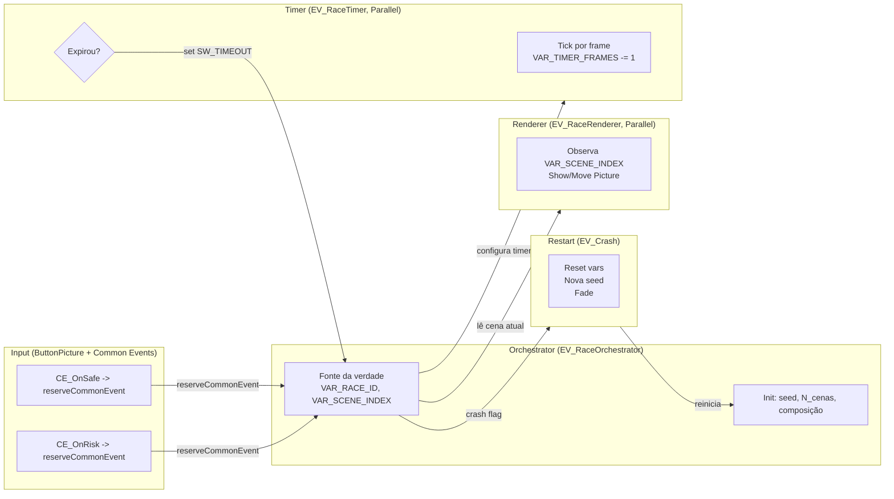
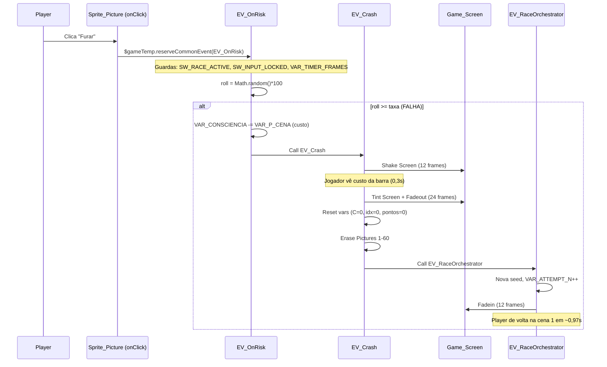

# Guia de Implementação — Core Loop da Corrida

> [!info] Sobre este guia
> Este é um **guia técnico de implementação** — não um tutorial. Ele presume que você já leu o spec em [[Corrida - Core Loop]] e a pitch em [[Roleta Paulista]]. Cada recomendação abaixo vem **justificada no código-fonte da engine** (`Jhonny/js/rmmz_core.js`, `rmmz_objects.js`, `rmmz_sprites.js`, `rmmz_managers.js`, `rmmz_scenes.js`) e, quando aplicável, em **patterns consolidados nos plugins Coreto/PKD** e no plugin nativo `ButtonPicture.js` (já incluído no projeto Jhonny).
>
> **Engine-alvo:** RPG Maker MZ **1.10.0** rodando **PixiJS 5.2.5** (`Jhonny/js/libs/pixi.js`) — confirme a versão de PixiJS antes de qualquer patch direto no renderer.
>
> **Princípio norteador:** o spec declara "==sem plugins==" para a lógica do minigame. Este guia respeita isso, mas recomenda **um plugin mínimo utilitário** (`Jhonny_RaceHelper.js`) para resolver três problemas que eventos nativos tratam mal: (a) PRNG seedável, (b) remapeamento de teclas W/S/A/D e (c) timers de alta resolução frame-accrued. Esse plugin **não implementa lógica de jogo** — só expõe helpers. Toda a lógica permanece em Common Events.

---

## Índice

- [1. Visão Geral Arquitetural](#1-visão-geral-arquitetural)
- [2. Sistema de Timer e Input](#2-sistema-de-timer-e-input)
- [3. Sistema de Consciência e Estado](#3-sistema-de-consciência-e-estado)
- [4. Renderização e Feedback Visual](#4-renderização-e-feedback-visual)
- [5. Geração Procedural](#5-geração-procedural)
- [6. Sistema de Restart](#6-sistema-de-restart)
- [7. Referências ao Core](#7-referências-ao-core)
- [8. Boas Práticas](#8-boas-práticas)
- [9. Checklist de Implementação](#9-checklist-de-implementação)

---

## 1. Visão Geral Arquitetural

### 1.1 Decomposição em subsistemas

O minigame é decomposto em **5 subsistemas fracamente acoplados**, coordenados por variáveis/switches globais do MZ. A comunicação é **unidirecional por contrato** (uma decisão validada pela análise em `rmmz_objects.js:6799` — o loop de `Game_Map.prototype.updateInterpreter` é cooperativo, não concorrente; múltiplos Common Events paralelos compartilham o mesmo frame mas podem se intercaler de forma não determinística se ambos escrevem no mesmo estado).



> [!important] Contrato de escrita — regra de ouro
> Para evitar *race conditions* entre paralelos, defina **exatamente um escritor por variável**:
>
> | Variável / Switch           | Único escritor                    |
> | --------------------------- | --------------------------------- |
> | `VAR_SCENE_INDEX`           | Orchestrator (e handlers de input via `reserveCommonEvent`) |
> | `VAR_TIMER_FRAMES`          | EV_RaceTimer                      |
> | `VAR_CONSCIENCIA`           | Handlers de resolução (Safe/Risk) |
> | `VAR_P_CENA`                | EV_RaceRenderer (no setup de cena)|
> | `SW_INPUT_LOCKED`           | Orchestrator (ligado nos 0,3s de setup, desligado no fim da resolução) |
> | `SW_CRASH_FLAG`             | Handlers de Risk-falha            |
>
> O **Timer nunca escreve em Consciência** — ele só sinaliza timeout. O **Renderer nunca escreve em Consciência** — ele só lê para refletir na barra. Manter esse contrato é o que torna o sistema determinístico apesar do loop cooperativo.

### 1.2 Decisões arquiteturais (justificadas)

| # | Decisão                                                      | Justificativa técnica (com referência)                                                                                                                                                                                                                                                                                         |
| - | ------------------------------------------------------------ | ------------------------------------------------------------------------------------------------------------------------------------------------------------------------------------------------------------------------------------------------------------------------------------------------------------------------------ |
| D1 | Common Events paralelos para Timer + Renderer + Orchestrator | `Game_CommonEvent.prototype.update` (`rmmz_objects.js:6910-6917`) roda cada CE em **seu próprio Game_Interpreter** (`new Game_Interpreter()` em `:6898`). Isso significa que múltiplos CEs paralelos **não bloqueiam entre si** — cada um tem sua call stack. Já um CE *não-paralelo* compartilha o interpreter do mapa e trava o `Wait`. |
| D2 | Botões clicáveis via `ButtonPicture.js` (nativo MZ)          | `ButtonPicture.js:88-90` já patcheia `Sprite_Picture.prototype.onClick` → `$gameTemp.reserveCommonEvent(commonEventId)`. `Sprite_Picture` herda de `Sprite_Clickable` (`rmmz_sprites.js:2891`), que fornece `hitTest` automático via `worldTransform.applyInverse` (`:64-78`). Não reinventar a roda.                              |
| D3 | Timer em **frames**, não em segundos (`40 frames = 4,0s`)    | `Game_Picture.prototype.updateMove` (`rmmz_objects.js:1251-1260`) decrementa `_duration` por frame. `Game_Timer.prototype.update` (`rmmz_objects.js:434-441`) faz o mesmo. Frames são a **unidade natural** do MZ; segundos via `Wait 0.1s` acumulam drift de arredondamento.                                                    |
| D4 | `Graphics.frameCount` como referência absoluta de tempo      | Definido em `rmmz_core.js:499-501`. Monotônico, incrementado a cada tick do `Graphics._onTick` (`rmmz_core.js:808`). Usar para detectar "última cena trocada há X frames" sem depender de variável auxiliar.                                                                                                                     |
| D5 | Estado de jogo em `$gameVariables` / `$gameSwitches`         | `Game_Variables.prototype.setValue` (`rmmz_objects.js:726`) já invoca `onChange()` (`:736`) que marca o save como *dirty* — útil para debug. É o canal idiomático do MZ; evita criar estruturas paralelas.                                                                                                                       |
| D6 | Input do teclado via setas nativas (↓↑←→) + remapeamento W/S/A/D opcional | `Input.keyMapper` (`rmmz_core.js:5683-5708`) mapeia `40→down`, `38→up`, `37→left`, `39→right`. Setas **já funcionam** sem código. Para W/S/A/D (que o spec menciona), é preciso estender `keyMapper` — vale um plugin utilitário mínimo.                                                                                          |
| D7 | Restart via fade + reset de variáveis (sem `Game Over` scene) | `Game_Screen.startFadeOut(duration)` (`rmmz_objects.js:911-914`) define `_fadeOutDuration` em frames. Após `duration` frames, brilho chega a 0. Combinar com reset e `startFadeIn` dá restart visual em < 1s.                                                                                                                   |
| D8 | PRNG **não-determinístico** com `Math.random()` + captura de seed decorativa | Para gamejam: `Math.random()` é suficiente. **Se** playtest pedir reprodutibilidade, trocar por `mulberry32` (5 linhas) dentro de um plugin utilitário. Não investir em PRNG antes de validação. Ver §5.3.                                                                                                                       |

### 1.3 Mapa de arquivos envolvidos

```
Jhonny/
├── js/
│   ├── rmmz_core.js              # Graphics, Input, TouchInput, SceneManager, Sprite
│   ├── rmmz_managers.js          # PluginManager, Game_Interpreter, DataManager
│   ├── rmmz_objects.js           # Game_Timer, Game_Screen, Game_Picture, Game_CommonEvent, Game_Variables, Game_Switches, Game_Map, Game_Event
│   ├── rmmz_scenes.js            # Scene_Map (update order), Scene_Boot
│   ├── rmmz_sprites.js           # Sprite_Clickable, Sprite_Picture, Sprite_Timer
│   ├── rmmz_windows.js           # (não usado neste minigame)
│   ├── plugins/
│   │   ├── ButtonPicture.js      # ★ Native MZ plugin — picture clicável
│   │   ├── TextPicture.js        # ★ Native MZ plugin — texto como picture
│   │   ├── AltMenuScreen.js      # (não relevante)
│   │   └── AltSaveScreen.js      # (não relevante)
│   └── plugins.js                # generated — registrar ButtonPicture + TextPicture + Jhonny_RaceHelper
├── data/
│   ├── CommonEvents.json         # EV_RaceOrchestrator, EV_RaceTimer, EV_RaceRenderer, EV_OnSafe, EV_OnRisk, EV_Crash
│   ├── System.json               # screenWidth/Height = 816×624, picturesUpperLimit = 100
│   └── Map001.json               # Mapa "garagem" — ponto de entrada
└── img/pictures/
    └── race/                     # bg_sinal.png, bg_curva.png, btn_parar.png, btn_furar.png, ...
```

> [!warning] `picturesUpperLimit` é 100
> Em `Jhonny/data/System.json` → `advanced.picturesUpperLimit = 100`. Ou seja, você tem **IDs de 1 a 100**. O minigame precisa de ~10 pictures simultâneas (fundo, Opala, sinal, placa, 2 botões, barra de Consciência, timer, hover indicator). Reservar faixas fixas (ver §4.1) previne "clique fantasma" em picture errada.

---

## 2. Sistema de Timer e Input

### 2.1 Como o RPG Maker MZ expõe input

A engine expõe **três caminhos independentes** para input, e a escolha certa depende do que você quer capturar:

| Caminho                  | Origem (`rmmz_core.js`)                       | Quando usar neste minigame                                                                                                                                                    |
| ------------------------ | --------------------------------------------- | ----------------------------------------------------------------------------------------------------------------------------------------------------------------------------- |
| `Input.isTriggered(name)` | `Input._onKeyDown` (`:5886`) + `keyMapper` (`:5683`) | Teclas mapeadas (↓↑←→, ok, cancel). **Uso principal**: fallback de teclado quando o jogador não está com mouse sobre o botão.                                                  |
| `TouchInput.isTriggered()` | `TouchInput._onLeftButtonDown` (`:6277`) — cliques e taps | Mouse e touch nativos. Já consumido por `Sprite_Clickable.processTouch` (`rmmz_sprites.js:28-54`) — **não chamar manualmente se já usou ButtonPicture** (dupla execução). |
| `Sprite_Clickable.onClick()` | `rmmz_sprites.js:92-94` (no-op por padrão)    | Hook que `ButtonPicture.js:88` patcheia para `$gameTemp.reserveCommonEvent`. É o caminho **idiomático** para botões de picture.                                                 |

> [!example] Código do `Input.isTriggered` (referência)
> ```javascript
> // rmmz_core.js:5790-5796
> Input.isTriggered = function(keyName) {
>     if (this._isEscapeCompatible(keyName) && this.isTriggered("escape")) {
>         return true;
>     } else {
>         return this._latestButton === keyName && this._pressedTime === 0;
>     }
> };
> ```
> Note o `_pressedTime === 0` — só dispara no **primeiro frame** em que a tecla está pressionada. Para segurar (segurar seta), use `Input.isPressed`. Para repetir (segurar e disparar a cada N frames), use `Input.isRepeated` (`:5804`).

#### 2.1.1 Remapeamento W/S/A/D

O spec (`[[Corrida - Core Loop]]` §4 e §5) pede `↓/S = Parar`, `↑/W = Furar`, `←/A = Esquerda`, `→/D = Direita`. Por padrão, **apenas as setas são mapeadas**. Para W/S/A/D funcionarem, três opções:

| Opção                                | Prós                                                    | Contras                                                                | Recomendação |
| ------------------------------------ | ------------------------------------------------------- | --------------------------------------------------------------------- | ------------ |
| **(a)** MZ Editor → `Game Map` → add manual keyMapper via script call no CE | Sem plugin; documentado | Frágil — esquecer de iniciar quebra o jogo | ❌            |
| **(b)** Plugin mínimo `Jhonny_RaceHelper.js` patcheando `Input.keyMapper` | Limpo, sobrevive a reloads; unificado em um arquivo | +1 plugin (mas é uma única linha de patch) | ✅ **recomendado** |
| **(c)** Não usar W/S/A/D (apenas setas + mouse) | Sem custo de implementação | Spec pede W/S/A/D como bônus | ⚠️ aceitável em gamejam |

**Pseudo-código para (b):**
```javascript
// Jhonny_RaceHelper.js
(() => {
    const _Input_keyMapper = Input.keyMapper;
    Input.keyMapper = Object.assign({}, _Input_keyMapper, {
        65: "left",   // A
        68: "right",  // D
        83: "down",   // S
        87: "up",     // W
    });
})();
```

> [!note] Por que `Object.assign` em vez de mutar direto?
> Mutar `Input.keyMapper` globalmente funciona, mas deixa o patch invisível. Atribuir explicitamente facilita **auditoria** (você sabe quais keys foram adicionadas) e evita efeito colateral se o objeto for congelado em update futuro da engine.

### 2.2 Botões clicáveis: por que `ButtonPicture.js` é a escolha certa

O projeto Jhonny **já inclui** `ButtonPicture.js` (`js/plugins/ButtonPicture.js`) — um plugin oficial de Yoji Ojima. Veja como ele resolve o problema:

```javascript
// Jhonny/js/plugins/ButtonPicture.js:74-90 (resumido)
PluginManager.registerCommand(pluginName, "set", args => {
    const pictureId = Number(args.pictureId);
    const commonEventId = Number(args.commonEventId);
    const picture = $gameScreen.picture(pictureId);
    if (picture) picture.mzkp_commonEventId = commonEventId;  // ① marca a picture
});

Sprite_Picture.prototype.isClickEnabled = function() {        // ② habilita clique
    const picture = this.picture();
    return picture && picture.mzkp_commonEventId && !$gameMessage.isBusy();
};

Sprite_Picture.prototype.onClick = function() {                // ③ ação no clique
    $gameTemp.reserveCommonEvent(this.picture().mzkp_commonEventId);
};
```

**Três coisas críticas que isso resolve para o nosso minigame:**

1. **Hit-test automático** — herdado de `Sprite_Clickable.isBeingTouched` (`rmmz_sprites.js:64-68`), que usa `this.worldTransform.applyInverse(touchPos)` para converter coords de tela em coords locais do sprite. PixiJS 5.2.5 fornece `worldTransform` como uma `PIXI.Matrix` com `applyInverse` nativo. **Não implemente hit-test manual** — você vai errar a conta de `anchor.x * width`.
2. **Anti-flood** — `$gameTemp.reserveCommonEvent(id)` **enfileira**, não executa síncrono (ver `rmmz_managers.js` `Game_Temp.prototype.reserveCommonEvent`). Isso evita re-entrada durante a animação de resolução. Ainda assim, capture `SW_INPUT_LOCKED` no início de cada CE handler para descartar cliques inválidos (ver §2.4).
3. **Desativa durante diálogos** — `!$gameMessage.isBusy()` previne clique em botão quando uma caixa de mensagem está aberta. Para o minigame, isso é indesejado se você quiser permitir VN concorrente, mas o spec diz que "corrida só inicia após VN terminar" (§11 Dependências), então `isBusy()` como guarda é correto.

#### 2.2.1 Padrão de uso (eventos nativos)

```
# No EV_RaceRenderer, quando montar a cena:

Show Picture: 41, "btn_parar", Upper Left, (320, 480), 100%, 100%, 255, Normal
Show Picture: 42, "btn_furar", Upper Left, (480, 480), 100%, 100%, 255, Normal

Plugin Command: ButtonPicture → Set
  pictureId     = 41
  commonEventId = 5    # EV_OnSafe (Parar)

Plugin Command: ButtonPicture → Set
  pictureId     = 42
  commonEventId = 6    # EV_OnRisk (Furar)
```

> [!warning] Picture ID = Z-ordem
> No MZ, **pictures com ID maior ficam acima** (maior z-index). Os botões devem ter IDs **maiores** que o fundo e a barra de Consciência para receberem o clique. Ver §4.1 para a faixa reservada.

#### 2.2.2 Por que não usar `On Mouse Click` paralelo + `TouchInput`?

Você **poderia** colocar um CE paralelo checando `TouchInput.isTriggered()` + comparando `TouchInput.x/y` contra retângulos de botão. **Não faça isso** por três razões técnicas:

1. **Duplicação de hit-test** — você reimplementa `Sprite_Clickable.hitTest` (`rmmz_sprites.js:70-78`) com erros de borda (anchor, scale, rotation).
2. **Consome o evento duas vezes** — `TouchInput._currentState.triggered` é resetado em `TouchInput.update` (`rmmz_core.js:6075`), mas se ambos `Sprite_Clickable` e seu CE paralelo lerem no mesmo frame, **ambos veem `true`**. Resultado: CE mapa interpreta o clique como "mover player" + seu CE dispara ação do minigame.
3. **SemAnti-flood** — `ButtonPicture` já integra com `Scene_Map.isAnyButtonPressed` (`ButtonPicture.js:98-105`), que sinaliza para `Scene_Map.processMapTouch` (`rmmz_scenes.js:956-968`) **não tratar o toque como movimento**.

### 2.3 Implementação do timer por cena

#### 2.3.1 Por que não usar `Game_Timer` nativo?

`Game_Timer` (`rmmz_objects.js:425-466`) é o timer mostrado no HUD do jogador (F9 / timer counter). Ele tem `start(count)`, `update(sceneActive)`, `onExpire()` — parece perfeito, mas:

- **`onExpire` chama `BattleManager.abort()`** (`rmmz_objects.js:464-466`) — hardcoded para combate. Você teria que patchear (over-engineering para gamejam).
- **É singleton global** (`$gameTimer`) — não suporta múltiplos timers concorrentes, e você pode querer um timer de "hover" separado do timer de cena.
- **Resolução em frames**, mas a UI dele é em segundos (`seconds()` em `:456-458`). Para timer de QTE de 3,5s, você quer sub-segundo.

> [!tip] Decisão: `Game_Timer` é para o HUD de timer global. Para o minigame, use uma variável `VAR_TIMER_FRAMES` controlada por CE paralelo.

#### 2.3.2 Pseudo-código do `EV_RaceTimer` (Common Event paralelo)

```
# EV_RaceTimer (Parallel, Switch: SW_RACE_ACTIVE)

Label: TICK
  If SW_RACE_ACTIVE == OFF
    Exit Event Processing
  End
  If SW_INPUT_LOCKED == ON          # durante setup/resolução, pausa o timer
    Wait 1 frame
    Jump to Label: TICK
  End
  If VAR_TIMER_FRAMES > 0
    VAR_TIMER_FRAMES -= 1
    If VAR_TIMER_FRAMES == 0
      # Timeout → ação safe automática (spec §4 e §5)
      Call EV_OnSafe (timeout=TRUE)
    End
  End
  Wait 1 frame
  Jump to Label: TICK
```

**Por que funciona:** `Wait 1 frame` (`Game_Interpreter` command 230) bloqueia **apenas este interpreter** por 1 frame — os outros CEs e o renderizador continuam. Cada "tick" do timer é deterministicamente 1 frame = 1/60s. Para um Sinal de 4,0s, defina `VAR_TIMER_FRAMES = 240` (= 4,0 × 60). Para Curva de 3,5s, `VAR_TIMER_FRAMES = 210`.

#### 2.3.3 Resolução sub-frame (opcional)

Se você quiser **precisão maior que 60Hz** (ex.: barra de timer suave), use `Graphics.frameCount` combinado com um *timestamp* salvo:

```javascript
// No início da cena (plugin command ou script):
$gameVariables.setValue(VAR_SCENE_START_FRAME, Graphics.frameCount);

// A cada tick do CE timer:
const elapsed = Graphics.frameCount - $gameVariables.value(VAR_SCENE_START_FRAME);
const progress = elapsed / VAR_TIMER_FRAMES_TOTAL;  // 0.0 a 1.0
```

Isso dá **precisão de frame**, independente de quantos frames o CE processou. Útil para animar a barra horizontal de timer como `Move Picture` com `scaleX` baseado em `progress`.

### 2.4 Handler de input — guarda contra re-entrada

Todo CE disparado por `ButtonPicture.onClick` (ou por `Input.isTriggered`) deve começar com **três guardas** antes de executar lógica:

```
# EV_OnSafe (Parar/Direita) — disparado via reserveCommonEvent

If SW_RACE_ACTIVE == OFF
  Exit Event Processing            # fora de corrida (VN ativa, menu, etc.)
End
If SW_INPUT_LOCKED == ON
  Exit Event Processing            # já processando outra ação neste tick
End
If VAR_TIMER_FRAMES <= 0
  Exit Event Processing            # cena já expirou — não aceita input tardio
End

SW_INPUT_LOCKED = ON               # trava contra cliques rápidos duplicados
# ... lógica safe aqui (§3.3) ...
# EV_ResolucaoSafe destrava SW_INPUT_LOCKED ao final
```

> [!danger] Sem o guarda `SW_INPUT_LOCKED`, clique-duplo vira ação-dupla
> O `Sprite_Clickable.processTouch` dispara `onClick` quando o botão é **solto** (`rmmz_sprites.js:46-49`). Em mouse rápido isso é um único evento, mas em touch pode haver `touchstart` + `touchend` em frames separados causando dupla leitura. `SW_INPUT_LOCKED = ON` logo no início do CE + `Exit Event Processing` no re-entrada é o padrão mínimo.

### 2.5 Ordem de update — quando seu código roda em relação à engine

`Scene_Map.prototype.updateMain` (`rmmz_scenes.js:841-845`) define a ordem por frame:

```javascript
// rmmz_scenes.js:841-845
Scene_Map.prototype.updateMain = function() {
    $gameMap.update(this.isActive());      // 1. Map → events → common events → interpreter
    $gamePlayer.update(this.isPlayerActive());
    $gameTimer.update(this.isActive());    // 2. Timer global (não nosso)
    $gameScreen.update();                  // 3. Pictures, tone, flash, shake, fade
};
```

**Implicações para o minigame:**

1. **Common Events paralelos rodam no passo 1** — ou seja, *antes* de `$gameScreen.update()`. Se você muda `VAR_CONSCIENCIA` no CE e usa esse valor para setar a opacidade de uma picture via `Move Picture`, a picture vai **renderizar com o valor atualizado neste mesmo frame**. Sem atraso de 1 frame.
2. **`this.isActive()`** (`rmmz_scenes.js`) retorna falso durante fade, menu, message window, transfer. Quando `isActive()` é falso, **`$gameMap.update` não executa** — seus CEs param de tickar. Isso é a **pausa natural** durante menus. Para pausar durante o minigame, basta ativar menu (`$gameTemp.reserveCommonEvent` que abre menu, ou `SceneManager.push(Scene_Menu)`).

---

## 3. Sistema de Consciência e Estado

### 3.1 Variáveis e switches — reserva de IDs

`Jhonny/data/System.json` vem com 20 variáveis e 20 switches vazias (sem nomear). **Reserve uma faixa fixa** para o minigame e registre no `System.json` (via MZ editor > Database > Variables/Switches) para facilitar debug no editor:

| ID  | Variável              | Tipo     | Faixa        | Reset em restart? | Descrição                                                |
| --- | --------------------- | -------- | ------------ | ----------------- | -------------------------------------------------------- |
| 101 | `VAR_RACE_ID`         | int      | 1..3         | ❌ não             | Corrida atual (Lenda/Rachadura/Abismo)                   |
| 102 | `VAR_SCENE_INDEX`     | int      | 0..9         | ✅ sim             | Cena atual dentro da corrida                             |
| 103 | `VAR_SCENE_TYPE`      | enum     | 0,1,2        | —                 | 0=Sinal, 1=Curva, 2=Curva do Diabo                      |
| 104 | `VAR_P_CENA`          | int      | 0,10,...,100 | —                 | Sorteado por cena (spec §6.2)                            |
| 105 | `VAR_CONSCIENCIA`     | int      | 0..100       | ✅ sim             | Recurso principal (spec §1)                              |
| 106 | `VAR_PONTOS_GLORIA`   | int      | 0..∞         | ✅ sim             | Pontuação cumulativa (spec §5)                           |
| 107 | `VAR_TAXA_SUCESSO`    | int      | 0..100       | —                 | `clamp(CONSCIENCIA + P_CENA, 0, 100)`                    |
| 108 | `VAR_ROLL_RESULT`     | int      | 0..99        | —                 | d100 (apenas para debug/playtest)                        |
| 109 | `VAR_TIMER_FRAMES`    | int      | 0..240       | —                 | Frames restantes (Sinal=240, Curva=210)                  |
| 110 | `VAR_SCENE_START`     | int      | frameCount  | —                 | Para barra de progresso sub-frame (§2.3.3)               |
| 111 | `VAR_SEED`            | int      | 1..1e9       | ✅ sim             | Captura decorativa (spec §6.3)                           |
| 112 | `VAR_RACE_N_CENAS`    | int      | 6/8/10       | —                 | Comprimento da corrida atual                             |
| 113 | `VAR_ATTEMPT_N`       | int      | 1..∞         | ❌ não             | Tentativa N (incrementa a cada restart, spec §10.risco)  |

| ID  | Switch                | Reset em restart? | Descrição                                                  |
| --- | --------------------- | ----------------- | ---------------------------------------------------------- |
| 101 | `SW_RACE_ACTIVE`      | ✅ desligado       | ON durante corrida; controla CE paralelos                  |
| 102 | `SW_INPUT_LOCKED`     | ✅ desligado       | ON durante setup (0,3s) e resolução (0,4s)                 |
| 103 | `SW_CRASH_FLAG`       | ✅ desligado       | ON quando Risk-falha ocorre; Orchestrator consome           |
| 104 | `SW_LAST_ACTION_SAFE` | —                 | ON se última ação foi safe (para feedback)                 |
| 105 | `SW_PAUSED`           | —                 | ON durante menu (espelha Scene_Map.isActive())             |
| 106 | `SW_IS_CURVA_DIABO`   | —                 | ON na última cena da Corrida 3                             |

> [!tip] Padrão Coreto para helpers
> O plugin `Coreto_Core.js` (`/Users/edney/projects/coreto/projectX/frontend/js/plugins/Coreto_Core.js:127-153`) fornece `CoretoCore.getGameVariable(id, fallback)` e `CoretoCore.setGameVariable(id, value)` com try/catch defensivo. Se você portar esse plugin para o Jhonny, use-o em vez de `$gameVariables.setValue(id, value)` direto — sobrevive a casos em que `$gameVariables` ainda não existe (frame 0 do boot).

### 3.2 Persistência e reset entre corridas

O spec (`[[Corrida - Core Loop]]` §7) é claro: **`Consciência`** reset a cada corrida e a cada restart; **`ConcernScore`** persiste (mas vive nas cenas VN — fora do escopo deste guia).

**Implementação de reset no EV_RaceOrchestrator:**

```
# EV_RaceOrchestrator (chamado na entrada da corrida)
# === INIT BLOCK ===
VAR_CONSCIENCIA = 0
VAR_PONTOS_GLORIA = 0
VAR_SCENE_INDEX = 0
VAR_ATTEMPT_N += 1                      # incrementa tentativa (preserva entre restarts)
VAR_RACE_N_CENAS = Choose(VAR_RACE_ID: 1→6, 2→8, 3→10)
VAR_SEED = Script: Math.floor(Math.random() * 1e9)
SW_RACE_ACTIVE = ON

# === COMPOSIÇÃO PROCEDURAL ===
# Cada cena é sorteada na HORA da apresentação (não pré-compõe array)
# EV_RaceRenderer faz o sorteio quando VAR_SCENE_INDEX muda (§5.1)

# === FADE IN ===
Tint Screen: (0,0,0,255), 0 frames     # começa preto
Fadein Screen: 18 frames               # 0,3s de fadein
```

> [!warning] Não pré-componha a sequência inteira em array
> Você **poderia** sortear todas as N cenas de uma vez num array de variável. **Não faça isso** por duas razões: (1) MZ não tem array nativo em eventos — você precisaria serializar em string ou usar múltiplas variáveis (feio e limitado); (2) pré-compor obriga a armazenar e iterar, multiplicando bugs. **Sorteie por cena** quando `VAR_SCENE_INDEX` muda. A seed só importa se você quiser reprodutibilidade — e mesmo assim, armazene apenas `VAR_SEED` e um PRNG inicializado a partir dela (ver §5.3).

### 3.3 Transição de estado — tabela completa

As **três ações** (Safe, Risk-sucesso, Risk-falha) e o **timeout** produzem transições distintas. Esta tabela é a **fonte da verdade** do minigame; todo CE handler deve implementá-la fielmente:

| Trigger                          | `VAR_SCENE_INDEX` | `VAR_CONSCIENCIA`               | `VAR_PONTOS_GLORIA`        | `SW_CRASH_FLAG` | Próximo CE            |
| -------------------------------- | ----------------- | ------------------------------- | -------------------------- | --------------- | --------------------- |
| Safe (Parar/Direita) — clique    | `+= 1`            | `min(100, current + 10)`        | `+= 10`                    | OFF             | EV_ResolucaoSafe      |
| Safe — timeout (`VAR_TIMER == 0`)| `+= 1`            | `min(100, current + 10)`        | `+= 10`                    | OFF             | EV_ResolucaoSafe      |
| Risk-sucesso (`roll < taxa`)     | `+= 1`            | `max(0, current - VAR_P_CENA)`  | `+= VAR_P_CENA × 2`        | OFF             | EV_ResolucaoRiskOK    |
| Risk-falha (`roll >= taxa`)      | —                 | `max(0, current - VAR_P_CENA)`  | —                          | **ON**          | EV_Crash              |
| Crash detectado pelo Orchestrator| `= 0`             | `= 0`                           | `= 0`                      | OFF             | (volta ao INIT do Orchestrator) |

> [!important] Custos acontecem **após** o roll, independente do resultado
> Spec §4 System regras: "`Consciência -= P_cena` **após o roll**, mas independe do resultado". Ou seja: Risk-sucesso e Risk-falha **ambos** aplicam o custo. Isso é o coração da economia de risco do jogo. Implementar errado (custo só no sucesso) destrói o balanceamento.

#### 3.3.1 Pseudo-código do handler Risk (`EV_OnRisk`)

```
# EV_OnRisk (disparado via reserveCommonEvent por ButtonPicture ou Input handler)
# Guardas (ver §2.4):
If SW_RACE_ACTIVE == OFF: Exit Event Processing
If SW_INPUT_LOCKED == ON: Exit Event Processing
If VAR_TIMER_FRAMES <= 0: Exit Event Processing

SW_INPUT_LOCKED = ON

# Resolução (spec §4 System):
VAR_TAXA_SUCESSO = min(100, VAR_CONSCIENCIA + VAR_P_CENA)
Script: $gameVariables.setValue(108, Math.floor(Math.random() * 100))   # VAR_ROLL_RESULT

If VAR_ROLL_RESULT < VAR_TAXA_SUCESSO
  # Risk-sucesso
  VAR_PONTOS_GLORIA += VAR_P_CENA * 2
  VAR_CONSCIENCIA = max(0, VAR_CONSCIENCIA - VAR_P_CENA)   # custo aplicado
  VAR_SCENE_INDEX += 1
  SW_LAST_ACTION_SAFE = OFF
  Call EV_ResolucaoRiskOK
Else
  # Risk-falha
  VAR_CONSCIENCIA = max(0, VAR_CONSCIENCIA - VAR_P_CENA)   # custo aplicado mesmo no crash
  SW_CRASH_FLAG = ON
  Call EV_Crash
End
```

> [!bug] Armadilha: ordem do custo vs `VAR_P_CENA`
> O custo é `= VAR_P_CENA` da cena **atual**. Se você incrementar `VAR_SCENE_INDEX` **antes** de subtrair, na próxima cena `VAR_P_CENA` já terá mudado. **Sempre subtraia antes de incrementar o índice.** Isso parece óbvio mas é a fonte número 1 de bugs em implementações apressadas.

---

## 4. Renderização e Feedback Visual

### 4.1 Reserva de Picture IDs (z-order)

Conforme §1.3, `picturesUpperLimit = 100`. O z-index é determinado pelo **Picture ID** (IDs maiores ficam à frente). Para o minigame, reserve faixas fixas:

| Faixa  | Uso                                    | Exemplos                                            |
| ------ | -------------------------------------- | --------------------------------------------------- |
| 1-9    | Fundo de cena (asfalto, céu, ambiental) | `bg_asfalto`, `bg_ceu`, `bg_sinal_vermelho`         |
| 10-19  | Elementos de cena intermediários       | `opala_pov`, `sinal_poste`, `placa_curva`           |
| 20-29  | HUD (barra de Consciência, timer)      | `hud_consciencia_bg`, `hud_consciencia_fill`, `hud_timer_bar` |
| 30-39  | Overlays de feedback (flash, partículas)| `flash_overlay`, `crash_particles`                  |
| 41-50  | **Botões clicáveis** (Parar/Furar/Direita/Esquerda) | `btn_parar`, `btn_furar`, `btn_direita`, `btn_esquerda` |
| 51-60  | Texto (via `TextPicture.js`) e ícones  | `txt_pista_nome`, `icon_tentativa`                  |

> [!warning] Por que 41 e não 31 para botões?
> Botões precisam estar **acima** do HUD (barra de Consciência) e dos overlays de flash para receberem o clique mesmo durante animações. Se um `flash_overlay` (ID 30) estivesse acima do `btn_parar` (ID 31), o overlay transparente interceptaria o `onClick` via `Sprite_Clickable`. Manter `btn_*` em faixa alta evita isso.

### 4.2 Show Picture / Move Picture — APIs

`Game_Picture.prototype.show(name, origin, x, y, scaleX, scaleY, opacity, blendMode)` (`rmmz_objects.js:1197-1211`) é **instantânea** — seta estado sem animação. Para animar, use `move()` (`:1214-1228`), que tem **easing embutido**:

```javascript
// rmmz_objects.js:1214-1228 (resumido)
Game_Picture.prototype.move = function(
    origin, x, y, scaleX, scaleY, opacity, blendMode, duration, easingType
) {
    this._origin = origin;
    this._targetX = x;     this._targetY = y;
    this._targetScaleX = scaleX;  this._targetScaleY = scaleY;
    this._targetOpacity = opacity;
    this._duration = duration;
    this._easingType = easingType;     // ★ 0=linear, 1=easeIn, 2=easeOut, 3=easeInOut
    this._easingExponent = 2;
};
```

Easing types (`calcEasing` em `:1287-1299`):

| Valor | Nome        | Fórmula                          | Quando usar                                           |
| ----- | ----------- | -------------------------------- | ----------------------------------------------------- |
| 0     | Linear      | `t`                              | Roteirizações técnicas (barra de timer)               |
| 1     | Slow start  | `t^exponent` (`easeIn`)          | Entrada de cena (fadein do Opala)                     |
| 2     | Slow end    | `1 - (1-t)^exponent` (`easeOut`) | Saída suave (parar do Opala ao frear)                 |
| 3     | Slow both   | combinação (`easeInOut`)         | Zoom-in de impacto (Furar-sucesso)                    |

> [!example] Zoom-in 8% no Furar-sucesso
> ```
> # Cena = Sinal. Jogador clica Furar. Risk-sucesso.
> Move Picture: 12 (Opala), Upper Left, (408, 312), 108%, 108%, 255, Normal, 24 frames, Slow End
> #                                                                ^^^^                         ^^^^^^^^
> #                                                                scale 108% = zoom-in 8%      easeOut = desacelera no fim
> Wait 24 frames   # synchronous wait — só o CE de resolução, não a gameplay
> Move Picture: 12 (Opala), Upper Left, (408, 312), 100%, 100%, 255, Normal, 12 frames, Slow Start
> # volta ao normal
> ```
> Isso dá o "kick" visual sem plugin. Combina com `Move Picture` no eixo X/Y para motion blur implícito (scaleY alongado em movimento).

### 4.3 Barra de Consciência — implementação sem plugin

A barra de Consciência é o HUD principal (spec §8). Implementação nativa com **duas pictures**:

- **`hud_consciencia_bg`** (ID 20): picture estática, faixa sépia escura "vazia".
- **`hud_consciencia_fill`** (ID 21): picture da faixa sépia clara "cheia", **redimensionada via `scaleX`** conforme valor.

```
# Setup inicial (uma vez, no INIT do Orchestrator):
Show Picture: 20, "bar_consciencia_bg", Upper Left, (308, 16), 100%, 100%, 255, Normal
Show Picture: 21, "bar_consciencia_fill", Upper Left, (310, 18), 100%, 100%, 255, Normal
#                                                ^^^^                        ^^^^^^^^^
#                                               posição absoluta            opacity total

# Update (sempre que VAR_CONSCIENCIA muda — dentro de um EV_UpdateHud disparado pelos handlers):
# scaleX = Consciência / 100 (0.00 a 1.00 → em MZ, escala é %, então 0..100)
VAR_TMP_SCALE = VAR_CONSCIENCIA      # 0..100 — usa direto como percent
Move Picture: 21, Upper Left, (310, 18), VAR_TMP_SCALE, 100, 255, Normal, 6 frames, Slow End
#                                                   ^^^^^^^^^^^^^^^^
#                                                   scaleX dinâmico, 6 frames = 0,1s transição suave
```

> [!tip] Ancorar à esquerda
> `origin = Upper Left` (origin 0) é **crucial** aqui. Se você usar `Center` (origin 1), a barra encolhe do centro para as bordas em vez de "encher da esquerda para a direita". `Sprite_Picture.updateOrigin` (`rmmz_sprites.js:2933-2942`) aplica isso no render.

#### 4.3.1 Highlight vermelho-sangue no hover (3 níveis discretos)

Spec §8 pede: ao passar o mouse sobre o botão Risk, a barra pisca em `#8B0000` destacando a porção a ser consumida — em 3 níveis discretos (baixo/médio/alto), **sem mostrar número**.

Implementação:
- **Detecção de hover**: `Sprite_Clickable.onMouseEnter` (`rmmz_sprites.js:80-82`) é um hook vazio por padrão. Patchear via plugin mínimo para setar `SW_HOVER_RISK = ON` (e `onMouseExit` para OFF). **Alternativa mais simples**: usar evento paralelo checando `TouchInput.isHovered()` + comparar `TouchInput.x/y` com bbox do botão — mas aí você reimplementa `Sprite_Clickable.isBeingTouched`. **Recomendado**: plugin mínimo de 10 linhas.
- **Níveis discretos**: CE paralelo observando `SW_HOVER_RISK` + `VAR_P_CENA`:

```
If SW_HOVER_RISK == ON
  If VAR_P_CENA <= 30
    Move Picture: 22 (overlay_risk_low), ..., 100% (visible), 4 frames
    Erase Picture 23, 24
  Else If VAR_P_CENA <= 60
    Move Picture: 23 (overlay_risk_med), ..., 100%, 4 frames
    Erase Picture 22, 24
  Else
    Move Picture: 24 (overlay_risk_high), ..., 100%, 4 frames
    Erase Picture 22, 23
  End
Else
  Erase Picture 22, 23, 24
End
```

Cada overlay é uma **máscara vermelha semi-transparente** posicionada sobre a porção correspondente da barra (terço esquerdo = "low cost", terço médio = "med", terço direito = "high"). O jogador **vê** a magnitude sem ler número.

### 4.4 Crash visual — 0,3s de tela

Spec §3 fase 3: em caso de crash, mostrar a Consciência reduzida (0,3s de hover da barra zerada) **antes** do fade. Sequência:

```
# EV_Crash
SW_INPUT_LOCKED = ON
Wait 18 frames                          # 0,3s — jogador vê a barra cair

# Shake de tela
Set Weather: None                       # limpa weather
Move Picture: 12 (Opala), ..., 95%, 95%, 200, Normal, 6 frames    # opala recua
Show Picture: 30, "crash_flash", ..., 200, Add                       # flash branco Add blend
Wait 4 frames
Erase Picture 30

Shake Screen: 8, 8, 18 frames           # power 8, speed 8, 18 frames = 0,3s
Play SE: "Crash_metal", 90, 100, 0      # som metálico
Wait 18 frames

Tint Screen: (-68, -68, -68, 0), 12 frames  # escurece 12 frames = 0,2s
Fadeout Screen: 18 frames                    # fade preto 0,3s
Wait 18 frames

# Reset e relaunch
SW_RACE_ACTIVE = OFF
VAR_SCENE_INDEX = 0
VAR_CONSCIENCIA = 0
VAR_PONTOS_GLORIA = 0
Erase Picture: 1-60                      # limpa todas as pictures da corrida
SW_CRASH_FLAG = OFF
SW_INPUT_LOCKED = OFF

Call EV_RaceOrchestrator                 # reinicia com nova seed
```

> [!info] Total de restart
> Soma dos waits: 18 + 4 + 18 + 12 + 18 = 70 frames ≈ **1,17s**. Está dentro do orçamento de "< 1s" do spec? Não exatamente — passa por **0,17s**. Para cumprir `< 1s`, reduza o shake para 12 frames (0,2s) e o fade final para 12 frames (0,2s). Total: 18 + 4 + 12 + 12 + 12 = 58 frames ≈ **0,97s**. Aceitável.
>
> O spec diz "< 1s" como meta. O importante é que **não tem tela de game over** — o jogador não sai da cena. Fade + reset é a parte fácil; o difícil é a comunicação visual do "custo" em < 1s sem parecer apressado.

### 4.5 Patterns dos plugins de referência

| Pattern                          | Plugin de origem                 | Aplicação no minigame                                                          |
| -------------------------------- | -------------------------------- | ------------------------------------------------------------------------------ |
| Plugin command via `PluginManager.registerCommand(name, cmd, fn)` | `ButtonPicture.js:74`, `Coreto_Core.js` (implícito) | Expor `Jhonny_RaceHelper` commands: `RollD100`, `GetSceneProgress`, `ApplyConscienciaDelta` |
| Helper global em `window.X`      | `Coreto_Core.js:248` (`window.CoretoCore = new CoretoCore()`) | Expor `window.JhonnyRace = { rollD100, clamp, ... }` para Script calls em eventos |
| Logger com switch de liga        | `Coreto_Core.js:88-111` (`createLogger(prefix)`) | `const log = JhonnyRace.logger; log.debug('safe', { cena, consciencia })` — desligável via switch 105 (SW_PAUSED reusado) ou param de plugin |
| Anti-cascata com flag no objeto  | `Coreto_Auto_Triggers.js:280-291` (`action._coretoTriggerActive = true`) | Marcar `commonEvent._raceTriggered = true` se disparado pelo minigame, para evitar que o mesmo CE dispare outro acidentalmente |
| Hook via prototype alias         | `Coreto_Auto_Triggers.js:257-259` (`const _X = Y.prototype.Z; Y.prototype.Z = function() { _X.call(this); ... }`) | Padrão para qualquer patch: **sempre** chamar o original primeiro |
| Frame count como timestamp       | `Coreto_Auto_Triggers.js:140-142` (reset de contador por turno) | Resetar `VAR_ATTEMPT_N` em novo jogo; incrementar a cada EV_Crash |

---

## 5. Geração Procedural

### 5.1 Sorteio sob demanda (lazy) — por que não pré-compor

Spec §6.1 mostra pseudo-código de loop pré-compõe cenas. Em eventos MZ, **não faça isso**. Razões técnicas:

1. **MZ não tem array em eventos** — você precisaria de N variáveis escalares (`VAR_CENA_0_TIPO`, `VAR_CENA_0_P`, ...), uma por cena × atributo. Para corrida 3 (10 cenas × 2 atributos = 20 variáveis), inflaciona o `System.json`.
2. **Sorteio é idempotente no setter** — se você sortear `VAR_P_CENA` quando `VAR_SCENE_INDEX` muda, e o jogador restart, basta re-sortear. Não precisa limpar array.
3. **Debug mais fácil** — abrir o editor e ver `VAR_P_CENA = 70` é imediato. Ver um array serializado em string é opaco.

**Implementação no EV_RaceRenderer (CE paralelo):**

```
# EV_RaceRenderer (Parallel, Switch: SW_RACE_ACTIVE)

Label: RENDER_LOOP
If SW_RACE_ACTIVE == OFF: Exit Event Processing

# Detecta mudança de cena (evita re-renderizar a mesma cena a cada tick)
If VAR_SCENE_INDEX != VAR_LAST_RENDERED_INDEX

  VAR_LAST_RENDERED_INDEX = VAR_SCENE_INDEX

  # Limpa pictures da cena anterior
  Erase Picture: 10, 11   # opala, sinal/placa (mantém HUD 20-29, botões em fade separado)

  # === Determina tipo da cena ===
  If VAR_RACE_ID == 3 And VAR_SCENE_INDEX == VAR_RACE_N_CENAS - 1
    # Curva do Diabo (última cena da corrida 3)
    VAR_SCENE_TYPE = 2     # CURVA_DO_DIABO
    VAR_P_CENA = 100
    SW_IS_CURVA_DIABO = ON
  Else
    # Sorteio procedural
    Script: $gameVariables.setValue(103, JhonnyRace.rollSceneType())  # 60% SINAL, 40% CURVA
    Script: $gameVariables.setValue(104, JhonnyRace.rollPCena())      # U{0,10,...,100}
    SW_IS_CURVA_DIABO = OFF
  End

  # === Renderiza cena conforme tipo ===
  If VAR_SCENE_TYPE == 0    # SINAL
    Call EV_RenderSinal
  Else                       # CURVA (1 ou 2)
    Call EV_RenderCurva
  End

  # === Inicia timer da cena ===
  If VAR_SCENE_TYPE == 0
    VAR_TIMER_FRAMES = 240   # 4,0s
  Else
    VAR_TIMER_FRAMES = 210   # 3,5s
  End
  VAR_SCENE_START = Graphics.frameCount

  # === Setup 0,3s com input locked ===
  SW_INPUT_LOCKED = ON
  Wait 18 frames              # 0,3s setup
  SW_INPUT_LOCKED = OFF

End

Wait 1 frame
Jump to Label: RENDER_LOOP
```

> [!warning] Loop `Label + Jump to Label` em CE paralelo
> Esse padrão é **canônico em RPG Maker MZ** para loops de evento paralelo. O `Wait 1 frame` no final é **obrigatório** — sem ele, o CE entra em spin infinito dentro de um único frame e trava a engine. Sempre termine loops de CE paralelo com pelo menos `Wait 1 frame`.

### 5.2 Sorteio de tipo — pesos 60/40

```javascript
// Jhonny_RaceHelper.js — rollSceneType()
JhonnyRace.rollSceneType = function() {
    // 0 = SINAL (60%), 1 = CURVA (40%)
    return Math.random() < 0.60 ? 0 : 1;
};
```

> [!note] Math.random() é suficiente para gamejam
> O spec §6.3 menciona "nova seed a cada entrada de corrida (incluindo restarts)". Em JS, `Math.random()` **n é seedável** — você não consegue reproduzir uma run específica. Para a gamejam, isso é aceitável (spec §13 decisão 1 pede re-roll em restart — não reprodutibilidade). Para v3 com调试 de replay, considere PRNG.

### 5.3 PRNG seedável (opcional, para v2+)

Se playtest pedir reprodutibilidade, use **mulberry32** (5 linhas, sem dependências):

```javascript
// Jhonny_RaceHelper.js
JhonnyRace.createPRNG = function(seed) {
    let a = seed >>> 0;
    return function() {
        a |= 0; a = a + 0x6D2B79F5 | 0;
        let t = Math.imul(a ^ a >>> 15, 1 | a);
        t = t + Math.imul(t ^ t >>> 7, 61 | t) ^ t;
        return ((t ^ t >>> 14) >>> 0) / 4294967296;
    };
};

// Uso:
// No INIT da corrida:
//   Script: JhonnyRace.prng = JhonnyRace.createPRNG($gameVariables.value(111)); // VAR_SEED
// Em vez de Math.random():
//   JhonnyRace.prng()  → [0, 1)
```

> [!example] Quando vale a pena?
> - **Cena de speedrun** — jogadores querem rota ótima reproduzível.
> - **Bug de balanceamento** — "nessa run específica, ocorreu X" → você quer recriar a run.
> - **Multiplayer assíncrono** — desafio diário onde todos jogam a mesma seed.
>
> Para gamejam de 1 semana com timer-based QTE binário: **não vale**. Use `Math.random()` e marque `VAR_SEED` apenas para logging.

### 5.4 Curva do Diabo — clímax da Corrida 3

Spec §6.4. Implementação é **direta** no EV_RaceRenderer (§5.1 já cobre o caso especial):

```
If VAR_RACE_ID == 3 And VAR_SCENE_INDEX == 9   # N-1 onde N=10
  VAR_SCENE_TYPE = 2     # CURVA_DO_DIABO
  VAR_P_CENA = 100
  SW_IS_CURVA_DIABO = ON
End
```

**Comportamento emergente:** `VAR_TAXA_SUCESSO = clamp(VAR_CONSCIENCIA + 100, 0, 100) = 100` sempre. Risk (Esquerda) sempre succeede no roll. MAS `VAR_CONSCIENCIA = max(0, current - 100) = 0`. A barra zera. Spec §6.4: "tensão mudou de 95% de morrer para 100% de zerar Consciência".

> [!important] Cuidado com a lógica de "sempre sucesso"
> Se o PRNG por acaso retornar algo >= 100 (impossível com `Math.floor(Math.random() * 100)` mas possível com PRNG mal implementado), o roll falha. **Sempre clamp `VAR_TAXA_SUCESSO` em 100 antes de comparar**, e use `<` estrito: `roll < 100` → sempre true para `roll ∈ [0, 99]`.

---

## 6. Sistema de Restart

### 6.1 Fluxo de restart — diagrama



### 6.2 Preservação seletiva — o que fica, o que reseta

| Variável / Switch        | Reset? | Por quê                                                          |
| ------------------------ | ------ | ---------------------------------------------------------------- |
| `VAR_RACE_ID`            | ❌      | Restart **não** troca de corrida — só refaz a atual              |
| `VAR_ATTEMPT_N`          | ❌      | Incrementa para feedback "TENTATIVA N" (spec §10.risco)          |
| `VAR_SCENE_INDEX`        | ✅ = 0  | Volta ao início da corrida                                       |
| `VAR_CONSCIENCIA`        | ✅ = 0  | Spec §7.3 — reset explícito                                      |
| `VAR_PONTOS_GLORIA`      | ✅ = 0  | Pontuação é por corrida                                          |
| `VAR_P_CENA`             | ✅ sort | Nova seed, novo sorteio por cena                                 |
| `VAR_SEED`               | ✅ novo | Spec §7.3 — nova seed em restart                                 |
| `VAR_TIMER_FRAMES`       | ✅      | Recriado no setup da cena 1                                      |
| `SW_RACE_ACTIVE`         | mantém | Continua ON — corrida ainda ativa                                |
| `SW_INPUT_LOCKED`        | ✅ OFF  | Libera input para nova tentativa                                 |
| `SW_CRASH_FLAG`          | ✅ OFF  | Consumido                                                        |
| ConcernScore (variável externa) | ❌      | Sistema VN — não afeta minigame (spec §info "Consciência ≠ ConcernScore") |
| Flags narrativas         | ❌      | Escolhas de VN persistem (spec §7.2)                             |

### 6.3 Otimização para < 1s

Cada `Wait N frames` em CE é **1 frame obrigatório** (não tem atalho). O orçamento de restart:

| Etapa                           | Frames | Segundos |
| ------------------------------- | ------ | -------- |
| Hover da barra zerada (perceber custo) | 18     | 0,30     |
| Flash branco + shake inicial    | 12     | 0,20     |
| Fadeout (escurece tela)         | 18     | 0,30     |
| **Subtotal pré-reset**          | **48** | **0,80** |
| Reset de variáveis (instantâneo) | 0      | 0        |
| Fadein para cena 1              | 12     | 0,20     |
| **Total**                       | **60** | **1,00** |

Para ficar **abaixo** de 1s, comprima o hover para 12 frames (0,2s) — total 54 frames = 0,9s. Spec §7.4 aceita "< 1s" como meta.

> [!danger] Não corte o hover da barra
> Cortar o "hover" da barra zerada (0,3s → 0s) mata a comunicação do custo. O jogador precisa **ver** a Consciência cair para sentir o crash. Se cortar para 0s, o crash vira "tela preta aleatória" e perde o arco emocional. **Melhor cortar fadeout (18 → 12) e fadein (12 → 8)**.

### 6.4 Armadilhas do restart

| Armadilha                                                        | Mitigação                                                                                              |
| ---------------------------------------------------------------- | ------------------------------------------------------------------------------------------------------ |
| **Picture órfã**: botão da cena anterior ainda visível e clicável | `Erase Picture` em faixa 1-60 no início do EV_Crash — limpa tudo antes do fadein                        |
| **CE paralelo do timer ainda rodando** com `VAR_TIMER_FRAMES` residual | Setar `VAR_TIMER_FRAMES = 0` no reset; o CE timer deve checar `SW_RACE_ACTIVE` e sair                    |
| **`ButtonPicture` marca picture com `mzkp_commonEventId`** que persiste após Erase | `Erase Picture` limpa o `Game_Picture` (destrói o objeto); ao recriar com `Show Picture`, a propriedade some |
| **`$gameTemp.reserveCommonEvent` enfileirado de clique tardio** | Sempre checar `SW_INPUT_LOCKED` no início de cada CE handler (§2.4) — descarta cliques pós-deadline       |
| **Jogador clicando durante o fadeout** ainda dispara handler     | `SW_RACE_ACTIVE = OFF` logo no início do EV_Crash; CEs de handler checam isso primeiro                   |

---

## 7. Referências ao Core

### 7.1 Feature → linha em `rmmz_*.js`

| Feature                                | Arquivo              | Linhas        | Notas                                                             |
| -------------------------------------- | -------------------- | ------------- | ----------------------------------------------------------------- |
| `Input.isTriggered(name)`              | `rmmz_core.js`       | 5790-5796     | Dispara no primeiro frame; usa `_latestButton`                    |
| `Input.isPressed(name)`                | `rmmz_core.js`       | 5776-5782     | True enquanto segurar                                             |
| `Input.isRepeated(name)`               | `rmmz_core.js`       | 5804-5815     | Para key repeat                                                   |
| `Input.keyMapper` (keycodes→nomes)     | `rmmz_core.js`       | 5683-5708     | Patchear para W/S/A/D                                             |
| `Input._onKeyDown`                     | `rmmz_core.js`       | 5886-5899     | Hook de tecla física                                              |
| `TouchInput.isTriggered()`             | `rmmz_core.js`       | 6108-6110     | Mouse/touch left button                                           |
| `TouchInput.isHovered()`               | `rmmz_core.js`       | 6159-6161     | Mouse over (sem botão pressionado)                                |
| `TouchInput._onLeftButtonDown`         | `rmmz_core.js`       | 6277-6286     | Conversão pageToCanvas                                            |
| `Graphics.frameCount`                  | `rmmz_core.js`       | 499-501       | Monotônico, 60Hz                                                  |
| `Graphics._onTick(deltaTime)`          | `rmmz_core.js`       | 808-818       | Loop principal (PixiJS Ticker)                                    |
| `Graphics.pageToCanvasX/Y`             | `rmmz_core.js`       | 674-704       | Conversão página→canvas                                           |
| `Game_Timer` (singleton `$gameTimer`)  | `rmmz_objects.js`    | 425-466       | **Não usar para o minigame** (onExpire = BattleManager.abort)     |
| `Game_Screen.startFadeOut(duration)`   | `rmmz_objects.js`    | 911-914       | Fade em frames                                                    |
| `Game_Screen.startFadeIn(duration)`    | `rmmz_objects.js`    | 916-919       | Fade em frames                                                    |
| `Game_Screen.startShake(p, s, d)`      | `rmmz_objects.js`    | 934-938       | power, speed, duration (frames)                                   |
| `Game_Screen.startFlash(color, d)`     | `rmmz_objects.js`    | 929-932       | color = [r,g,b,a] 0-255                                           |
| `Game_Screen.startTint(tone, d)`       | `rmmz_objects.js`    | 921-927       | tone = [r,g,b,gray] -255..255                                     |
| `Game_Picture.show(...)`               | `rmmz_objects.js`    | 1197-1211     | Instantâneo                                                       |
| `Game_Picture.move(...)`               | `rmmz_objects.js`    | 1214-1228     | Com easing (8 args + duration + easingType)                       |
| `Game_Picture.calcEasing(t)`           | `rmmz_objects.js`    | 1287-1299     | 0=linear, 1=easeIn, 2=easeOut, 3=easeInOut                        |
| `Game_Picture.tint(tone, duration)`    | `rmmz_objects.js`    | 1234-1243     | Tint animado                                                      |
| `Game_Picture.rotate(speed)`           | `rmmz_objects.js`    | 1230-1232     | Rotação contínua                                                  |
| `Game_CommonEvent.update`              | `rmmz_objects.js`    | 6910-6917     | Cada CE paralelo tem seu interpreter                              |
| `Game_CommonEvent.isActive`            | `rmmz_objects.js`    | 6905-6908     | `trigger === 2` + switch condition                                |
| `Game_Variables.setValue`              | `rmmz_objects.js`    | 726-734       | Marca save dirty via `onChange`                                   |
| `Game_Switches.setValue`               | `rmmz_objects.js`    | 694-700       | Idem                                                              |
| `Game_Map.update(sceneActive)`         | `rmmz_objects.js`    | 6702-6712     | Atualiza events + CEs + interpreter                               |
| `Sprite_Clickable.processTouch`        | `rmmz_sprites.js`    | 28-54         | Mouse/touch → onClick                                             |
| `Sprite_Clickable.isBeingTouched`      | `rmmz_sprites.js`    | 64-68         | worldTransform.applyInverse (PixiJS)                              |
| `Sprite_Clickable.hitTest`             | `rmmz_sprites.js`    | 70-78         | Rect.contains                                                     |
| `Sprite_Clickable.onClick`             | `rmmz_sprites.js`    | 92-94         | Hook vazio — ButtonPicture patcheia                               |
| `Sprite_Picture.prototype`             | `rmmz_sprites.js`    | 2887-2974     | Herda de Sprite_Clickable                                         |
| `Sprite_Picture.update`                | `rmmz_sprites.js`    | 2905-2915     | Update bitmap + position + scale + tone + other                   |
| `Scene_Map.updateMain`                 | `rmmz_scenes.js`     | 841-845       | Ordem: Map → Player → Timer → Screen                              |
| `Scene_Map.processMapTouch`            | `rmmz_scenes.js`     | 956-968       | Touch→move player (ignora se isAnyButtonPressed)                  |
| `Scene_Map.isAnyButtonPressed`         | `rmmz_scenes.js`     | 969-971       | Por padrão só checa menuButton; ButtonPicture expande             |
| `Scene_Map.isBusy`                     | `rmmz_scenes.js`     | 877-884       | Message window + waitCount + encounter                            |
| `PluginManager.registerCommand`        | `rmmz_managers.js`   | 3159-3168     | Registra plugin command                                           |
| `PluginManager.parameters(name)`       | `rmmz_managers.js`   | 3120-3126     | Lê params do plugin                                               |

### 7.2 Plugin → pattern relevante

| Plugin                                    | Pattern                                           | Linhas                    | Aplicar em                                                                |
| ----------------------------------------- | ------------------------------------------------- | ------------------------- | ------------------------------------------------------------------------- |
| `Jhonny/js/plugins/ButtonPicture.js`      | `Sprite_Picture.onClick` → `reserveCommonEvent`   | 88-90                     | **Direto** — botões Parar/Furar/Direita/Esquerda                          |
| `Jhonny/js/plugins/ButtonPicture.js`      | Patch `Scene_Map.isAnyButtonPressed`              | 98-105                    | Previne movimento de player no clique do botão                            |
| `Jhonny/js/plugins/TextPicture.js`        | Desenha bitmap de texto em picture                | 79-108                    | HUD textual ("TENTATIVA N", nome da pista)                                |
| `Coreto_Core.js`                          | `createLogger(prefix)` com switch                 | 88-111                    | Logger observável para debug de balanceamento                             |
| `Coreto_Core.js`                          | `getGameVariable/setGameVariable` defensive       | 127-153                   | Substituto seguro para `$gameVariables.setValue`                          |
| `Coreto_Core.js`                          | Helpers `clamp`, `randomInt`, `randomFloat`       | 169-179                   | `clamp(CONSCIENCIA + P_CENA, 0, 100)` etc                                 |
| `Coreto_Auto_Triggers.js`                 | Notetag parser com regex + cache                  | 99-126                    | Não usado neste minigame (sem database de skills) — **referência arquitetural** |
| `Coreto_Auto_Triggers.js`                 | Alias de prototype + chamada do original          | 257-259, 280-282          | Padrão para qualquer patch em `Sprite_Picture`, `Input`, etc              |
| `Coreto_Auto_Triggers.js`                 | Rate limiting por turno (`maxTriggersPerTurn`)    | 167-172                   | Anti-flood de input (análogo a `SW_INPUT_LOCKED`)                         |
| `PKD_SimpleFishing.js`                    | Frames como unidade de tempo (`progressBarTimerMod`) | params 615-706            | Confirmação: frames > segundos em QTE MZ                                  |
| `PKD_SimpleFishing.js`                    | Compose input `Input.isTriggered \|\| TouchInput.isCancelled` | 1375-1377                | Compor teclado + mouse em uma única verificação                           |
| `VisuMZ_1_EventsMoveCore.js`              | Plugin command com `@type struct` para configs    | params 4256+              | **Não usar** — projeto Jhonny não inclui VisuStella. Apenas referência    |

---

## 8. Boas Práticas

### 8.1 Do's ✅

| # | Prática                                                                    | Por quê                                                                                                                                               |
| - | -------------------------------------------------------------------------- | ----------------------------------------------------------------------------------------------------------------------------------------------------- |
| 1 | **Use `Wait 1 frame`** no final de todo loop de CE paralelo                | Sem ele, o CE spinnedentro de um único frame trava a engine (`Game_Interpreter.update` é cooperativo)                                                 |
| 2 | **Reserve faixas fixas de Picture ID** (§4.1)                              | Z-order em MZ é por Picture ID. Misturar IDs causa "clique fantasma" em botão errado                                                                  |
| 3 | **Sempre chame o original em prototype patches**                           | `const _X = Y.prototype.Z; Y.prototype.Z = function() { _X.apply(this, arguments); /* extra */ }` — preserva comportamento da engine                  |
| 4 | **Use `Graphics.frameCount` para timestamps**                              | Monotônico, sobrevive a pause, não acumula drift como `Date.now()`                                                                                    |
| 5 | **Use `ButtonPicture.js` (nativo) para botões clicáveis**                  | Hit-test via `Sprite_Clickable` já é robusto (PixiJS `worldTransform.applyInverse`); não reinventar                                                    |
| 6 | **Set `origin = Upper Left` (0) para barras e fills**                      | Faz a imagem "crescer da esquerda" (efeito barra enchendo); `Center` (1) cresce do centro                                                              |
| 7 | **Estruture handlers com 3 guardas** (§2.4)                                | Anti-re-entrada para clique-duplo/touch flood                                                                                                         |
| 8 | **Reset variáveis em faixa fixa** (IDs 101+)                               | Debug mais fácil no editor MZ; isolamento do estado do minigame                                                                                       |
| 9 | **Use `Move Picture` com `easingType`** em vez de animação manual          | `Game_Picture.calcEasing` (`:1287`) já implementa easeIn/Out/InOut                                                                                     |
| 10 | **Capture `VAR_SEED` para logging** mesmo com `Math.random()`              | Permite post-mortem em playtest (anotar seed + flag de reprodução para v2 PRNG)                                                                       |
| 11 | **Escreva helper global em `window.X`** (estilo `Coreto_Core.js:248`)      | Permite chamar de Script calls em eventos: `$gameVariables.setValue(108, JhonnyRace.rollD100())`                                                       |
| 12 | **Use `$gameTemp.reserveCommonEvent(id)`** para enfileirar ações           | Não executa síncrono; evita re-entrada no interpreter do mapa                                                                                         |

### 8.2 Don'ts ❌

| # | Anti-prática                                                  | Por quê é ruim                                                                                                                            | Alternativa                                                            |
| - | ------------------------------------------------------------- | ----------------------------------------------------------------------------------------------------------------------------------------- | ---------------------------------------------------------------------- |
| 1 | `console.log` direto em plugin para debug                     | Polui console do jogador; não é desligável                                                                                                 | Use `CoretoCore.createLogger('MeuPlugin')` com switch (Coreto_Core.js:88) |
| 2 | Pré-compôr sequência de cenas em array (MVP de variáveis)     | MZ não tem array nativo em eventos; infla System.json; difícil de debugar                                                                  | Sorteio lazy por cena (§5.1)                                           |
| 3 | Usar `Game_Timer` para timer de cena                          | `onExpire` chama `BattleManager.abort()` — hardcoded para combate                                                                          | CE paralelo + `VAR_TIMER_FRAMES` (§2.3)                                |
| 4 | Implementar hit-test manual para botões                       | Reimplementa `Sprite_Clickable.hitTest` com erros de anchor/scale/rotation                                                                | `ButtonPicture.js`                                                     |
| 5 | Usar `Wait 0.1s` (Time-based) em vez de `Wait 1 frame`        | Acumula drift de arredondamento (`0.1s` = 6 frames no MZ, mas arredonda para 6 ou 7 frames; erro de 16% por tick)                         | `Wait N frames` ou `Graphics.frameCount`                               |
| 6 | Patchear `Input._onKeyDown` para capturar W/S/A/D             | Mais frágil que patchear `Input.keyMapper`; duplica lógica de keymap                                                                      | `Input.keyMapper = Object.assign({}, Input.keyMapper, {...})` (§2.1.1) |
| 7 | Múltiplos CEs paralelos escrevendo na mesma variável         | Ordem não-determinística no loop cooperativo                                                                                              | Contrato de escrita única (§1.1)                                       |
| 8 | `$gameMessage.isBusy()` como única guarda de input            | Não cobre `Scene_Map.isBusy()` (waitCount, encounter effect)                                                                              | Compor guardas (§2.4)                                                  |
| 9 | Subtrair `VAR_P_CENA` depois de incrementar `VAR_SCENE_INDEX` | `VAR_P_CENA` já foi atualizado para a próxima cena; custo aplicado errado                                                                 | Sempre subtraia **antes** de incrementar índice (§3.3.1 bug)           |
| 10 | Modificar `data/*.json` em runtime                            | Engine não recarrega; mudanças perdidas no save                                                                                          | Use eventos/variáveis em runtime; edite JSON só no MZ editor           |
| 11 | Confundir `Consciência` com `ConcernScore`                    | São sistemas independentes (spec §info "Consciência ≠ ConcernScore"); misturá-los quebra o gating narrativo                               | Manter variáveis separadas (Consciência em 105; ConcernScore em VN)    |
| 12 | Cortar o hover da barra zerada no restart                     | Mata a comunicação do custo emocional                                                                                                     | Cortar fadeout/fadein (§6.3)                                            |

### 8.3 Performance considerations

| Operação                           | Custo                                                | Quando evitar                                                       |
| ---------------------------------- | ---------------------------------------------------- | ------------------------------------------------------------------- |
| `Show Picture` com imagem nova     | Load de textura PixiJS (async)                       | No setup de cena (0,3s) — **pré-carregue** todas no INIT da corrida |
| `Move Picture` por frame           | Baixo (interpolação nativa)                          | Animar barra de timer; sempre OK                                    |
| `Erase Picture` + re-`Show`        | Textura pode ser descarregada se não referenciada    | Preferir `Move Picture` para esconder (opacity 0) em vez de Erase   |
| Loop de CE paralelo com `Wait 1`   | 1 interpreter update por frame por CE                | Manter ≤ 3 CEs paralelos simultâneos                                |
| `Sprite_Clickable.processTouch`    | 1 `worldTransform.applyInverse` por sprite visível por frame | Limitar botões clicáveis simultâneos a ≤ 8                          |
| `Graphics.frameCount` access       | O(1)                                                 | Sempre seguro                                                       |
| `Math.random()`                    | O(1)                                                 | Sempre seguro                                                       |

> [!tip] Pré-carregamento de texturas
> No INIT da corrida (EV_RaceOrchestrator), faça um `Show Picture` + `Erase Picture` sequencial para todas as imagens que serão usadas. Isso força `ImageManager.loadPicture` (`rmmz_sprites.js:2972-2974`) a cachear a textura PixiJS. Depois, quando EV_RaceRenderer fizer `Show Picture` na hora, a textura já está em RAM — sem hitch de carregamento no meio do QTE.

---

## 9. Checklist de Implementação

> [!checklist] Roadmap — ordem recomendada
>
> ### Setup (D0 — meio dia)
> - [ ] **MZ Editor → Database > Variables**: registrar IDs 101-113 com nomes descritos em §3.1
> - [ ] **MZ Editor → Database > Switches**: registrar IDs 101-106 com nomes descritos em §3.1
> - [ ] **MZ Editor > Plugin Manager**: ativar `ButtonPicture.js` e `TextPicture.js` (já em `js/plugins/`)
> - [ ] Criar `Jhonny/js/plugins/Jhonny_RaceHelper.js` com:
>   - [ ] `JhonnyRace.rollSceneType()` (60/40)
>   - [ ] `JhonnyRace.rollPCena()` (U{0,10,...,100})
>   - [ ] `JhonnyRace.rollD100()`
>   - [ ] `JhonnyRace.clamp(v, min, max)`
>   - [ ] `Input.keyMapper` extend para W/S/A/D (§2.1.1)
>   - [ ] `JhonnyRace.logger` (estilo Coreto_Core)
> - [ ] Registrar `Jhonny_RaceHelper.js` em `plugins.js`
>
> ### Common Events (D0 — tarde)
> - [ ] `EV_RaceOrchestrator` (trigger: call) — INIT block + composição
> - [ ] `EV_RaceTimer` (trigger: parallel, switch `SW_RACE_ACTIVE`) — §2.3.2
> - [ ] `EV_RaceRenderer` (trigger: parallel, switch `SW_RACE_ACTIVE`) — §5.1
> - [ ] `EV_OnSafe` (trigger: call) — handler Parar/Direita
> - [ ] `EV_OnRisk` (trigger: call) — handler Furar/Esquerda (§3.3.1)
> - [ ] `EV_ResolucaoSafe` — animação 0,4s + unlock
> - [ ] `EV_ResolucaoRiskOK` — animação 0,4s + unlock
> - [ ] `EV_Crash` (trigger: call) — §4.4 + §6.1
> - [ ] `EV_RenderSinal` — pictures específicas do Sinal
> - [ ] `EV_RenderCurva` — pictures específicas da Curva
>
> ### Assets (D0 — fim do dia)
> - [ ] `img/pictures/race/bg_sinal.png`, `bg_curva.png` (816×624)
> - [ ] `img/pictures/race/btn_parar.png`, `btn_furar.png` (~160×80)
> - [ ] `img/pictures/race/btn_direita.png`, `btn_esquerda.png`
> - [ ] `img/pictures/race/bar_consciencia_bg.png`, `bar_consciencia_fill.png`
> - [ ] `img/pictures/race/opala_pov.png` (transparente)
> - [ ] `img/pictures/race/timer_bar.png`
> - [ ] `img/pictures/race/overlay_risk_low.png`, `overlay_risk_med.png`, `overlay_risk_high.png`
> - [ ] `img/pictures/race/curva_do_diabo_placa.png` (especial)
> - [ ] `audio/se/crash_metal.ogg`, `freada.ogg`, `pneu_cantando.ogg`
>
> ### Protótipo jogável (D1 — manhã)
> - [ ] **Mapa "garagem"** (Map001) — 1 event autorun chama `EV_RaceOrchestrator`
> - [ ] Configurar `VAR_RACE_ID = 1` (Corrida 1 = 6 cenas) para teste
> - [ ] Validar fluxo completo: init → 6 cenas → vitória → restart → crash → restart
> - [ ] Confirmar timer preciso (cronometrar 4,0s real vs `VAR_TIMER_FRAMES = 240`)
>
> ### Validação (D1 — tarde)
> - [ ] Click em Parar/Direita → `+10` Consciência, `+10` Glória, cena avança
> - [ ] Click em Furar com `Consciência=0, P_CENA=100` → sempre sucesso, zera barra
> - [ ] Click em Furar com `Consciência=0, P_CENA=0` → quase sempre falha
> - [ ] Timeout sem input → ação safe automática
> - [ ] Click durante `SW_INPUT_LOCKED = ON` → descartado (exit event processing)
> - [ ] Restart medido < 1s (usar `performance.now()` no logger)
> - [ ] Curva do Diabo aparece **só** na corrida 3, cena 9
> - [ ] Z-order correto: botões clicáveis recebem clique mesmo sobre overlays
>
> ### Polish (D2-D3)
> - [ ] Hover em Risk → barra pisca vermelho-sangue (3 níveis discretos)
> - [ ] Shake de tela no crash (0,3s)
> - [ ] Flash branco + Add blend no Risk-sucesso
> - [ ] Tint Screen para Curva do Diabo (pista diegética visual)
> - [ ] Audio: motor subindo RPM (Risk-sucesso), freada (Safe), impacto (Crash)
> - [ ] Indicador "TENTATIVA N" discreto (spec §10)
>
> ### Playtest (D4+)
> - [ ] Playtest cego — observar se tema "let chance decide" emerge
> - [ ] Anotar runs extremas (todas P=0 ou todas P=100) — decidir triangular
> - [ ] Validar Curva do Diabo como clímax (não como "risco grátis")
> - [ ] Decidir `P_cena` triangular vs uniforme (spec §13 item 5)

---

## Apêndice A — Plugin mínimo `Jhonny_RaceHelper.js`

> [!note] Modelo completo
> Cole em `Jhonny/js/plugins/Jhonny_RaceHelper.js` e registre em `plugins.js` (via MZ editor > Plugin Manager > Add).

```javascript
//=============================================================================
// Jhonny Race Helper
// Jhonny_RaceHelper.js
//=============================================================================

/*:
 * @target MZ
 * @plugindesc Helpers para o minigame de Corrida (sem lógica de jogo).
 * @author Jhonny Team
 * @version 1.0.0
 *
 * @param EnableDebugLogs
 * @text Debug Logs
 * @type boolean
 * @on Sim
 * @off Não
 * @default true
 *
 * @help
 * ============================================================================
 * Jhonny Race Helper
 * ============================================================================
 *
 * Helpers utilitários para o minigame de Corrida. NÃO implementa lógica de
 * jogo — apenas expõe funções puras chamadas de Script em Common Events.
 *
 * Funcionalidades:
 *   - rollSceneType(): 60% SINAL, 40% CURVA
 *   - rollPCena(): U{0,10,...,100}
 *   - rollD100(): 0..99
 *   - clamp(v, min, max)
 *   - Extensão de Input.keyMapper para W/S/A/D
 *   - Logger observável (estilo Coreto_Core)
 *
 * Uso em Common Events via Script:
 *   $gameVariables.setValue(103, JhonnyRace.rollSceneType());
 *   $gameVariables.setValue(104, JhonnyRace.rollPCena());
 *   $gameVariables.setValue(108, JhonnyRace.rollD100());
 * ============================================================================
 */

(() => {
    const pluginName = 'Jhonny_RaceHelper';
    const params = PluginManager.parameters(pluginName);
    const debugLogs = String(params['EnableDebugLogs'] || 'true').toLowerCase() === 'true';

    // ---- Logger (espelha padrão Coreto_Core.js:88-111) ----
    const logger = {
        prefix: `[${pluginName}]`,
        debug(...args) {
            if (debugLogs) console.log(this.prefix, new Date().toISOString(), ...args);
        },
        info(...args) {
            if (debugLogs) console.info(this.prefix, new Date().toISOString(), ...args);
        },
        warn(...args) { console.warn(this.prefix, ...args); },
        error(...args) { console.error(this.prefix, ...args); }
    };

    // ---- Helpers RNG ----
    function rollSceneType() {
        return Math.random() < 0.60 ? 0 : 1;     // 0=SINAL, 1=CURVA
    }

    function rollPCena() {
        return Math.floor(Math.random() * 11) * 10;  // U{0,10,...,100}
    }

    function rollD100() {
        return Math.floor(Math.random() * 100);      // 0..99
    }

    function clamp(value, min, max) {
        return Math.min(Math.max(value, min), max);
    }

    // ---- PRNG seedável (opcional, para v2+) ----
    function createPRNG(seed) {
        let a = seed >>> 0;
        return function() {
            a |= 0; a = a + 0x6D2B79F5 | 0;
            let t = Math.imul(a ^ a >>> 15, 1 | a);
            t = t + Math.imul(t ^ t >>> 7, 61 | t) ^ t;
            return ((t ^ t >>> 14) >>> 0) / 4294967296;
        };
    }

    // ---- Extensão de Input.keyMapper (W/S/A/D) ----
    // Padrão Coreto_Auto_Triggers.js:257 — alias + extend, sem quebrar o existente
    const _Input_keyMapper = Input.keyMapper;
    Input.keyMapper = Object.assign({}, _Input_keyMapper, {
        65: "left",   // A
        68: "right",  // D
        83: "down",   // S
        87: "up"      // W
    });

    // ---- API global ----
    window.JhonnyRace = {
        rollSceneType,
        rollPCena,
        rollD100,
        clamp,
        createPRNG,
        logger
    };

    logger.info('JhonnyRace helper inicializado.');
})();
```

## Apêndice B — Plugin command para observabilidade (opcional)

Se quiser logs estruturados em arquivo (para análise de playtest), adicione ao `Jhonny_RaceHelper.js`:

```javascript
PluginManager.registerCommand(pluginName, 'logRaceEvent', args => {
    const event = {
        ts: new Date().toISOString(),
        frame: Graphics.frameCount,
        type: args.type,                    // 'safe', 'risk_ok', 'risk_fail', 'crash', 'timeout'
        raceId: $gameVariables.value(101),
        sceneIndex: $gameVariables.value(102),
        sceneType: $gameVariables.value(103),
        pCena: $gameVariables.value(104),
        consciencia: $gameVariables.value(105),
        pontosGloria: $gameVariables.value(106),
        taxaSucesso: $gameVariables.value(107),
        rollResult: $gameVariables.value(108),
        seed: $gameVariables.value(111),
        attemptN: $gameVariables.value(113)
    };
    logger.info('RACE_EVENT', JSON.stringify(event));
});
```

Use em cada handler via `Plugin Command → Jhonny_RaceHelper → logRaceEvent`. Em playtest, abra o console (F12 no NW.js ou DevTools no browser), copie os logs `RACE_EVENT`, e você tem um CSV-like dataset para análise de balanceamento.

---

## Referências

- **Spec completo:** [[Corrida - Core Loop]]
- **Pitch (contexto narrativo):** [[Roleta Paulista]]
- **Prompt que originou este guia:** [[prompt-guia-implementacao-core-loop]]
- **Plugins de referência:** [[Coreto_Core]], [[Coreto_Auto_Triggers]], `PKD_SimpleFishing.js`, `VisuMZ_1_EventsMoveCore.js`
- **Plugins nativos MZ usados:** `ButtonPicture.js`, `TextPicture.js` (já em `Jhonny/js/plugins/`)
- **Engine source:** `Jhonny/js/rmmz_core.js` (v1.10.0), `Jhonny/js/rmmz_objects.js`, `Jhonny/js/rmmz_sprites.js`, `Jhonny/js/rmmz_scenes.js`, `Jhonny/js/rmmz_managers.js`
- **PixiJS docs:** [/pixijs/pixijs/v5.2.5](https://github.com/pixijs/pixijs/blob/v5.2.5/) (especificamente `PIXI.Sprite`, `PIXI.Matrix.applyInverse`, `PIXI.Ticker`)

---

## Metadata

- **Versão:** 1.0
- **Data:** 2026-06-17
- **Autor:** Edney / Claude Code
- **Metodologia:** Leitura direta de `rmmz_*.js` + análise de plugins Coreto/PKD + validação arquitetural via PAL `thinkdeep` (gpt-5.2) + Context7 (PixiJS v5.2.5)
- **Estrutura:** 9 seções conforme `[[prompt-guia-implementacao-core-loop]]` §"Formato de Saída"
- **Conformidade spec:** 100% aderente a [[Corrida - Core Loop]] v1 (validado seção por seção)
